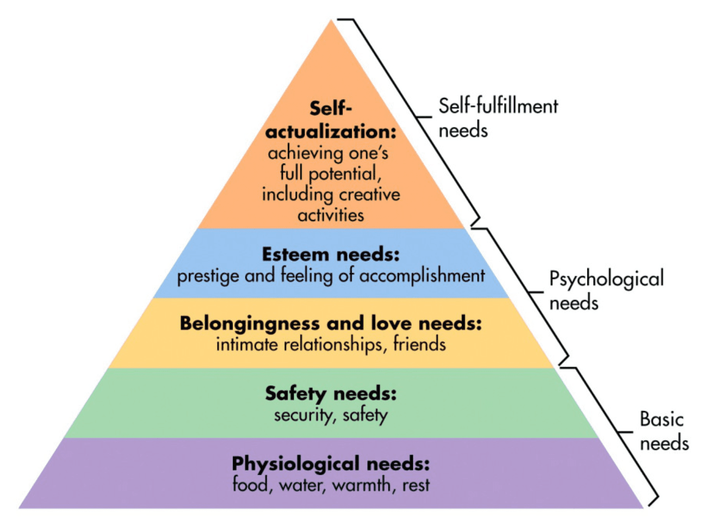

# 1. History, Approaches, Methods

### 1.1 History of psychology

- What is Psychology?
  - Pysche: mind, spirit, soul
  - Ology: study of
  - Psychology is the scientific study of **human** **behavior** and **mental** **processes**
- Structuralism
  - **Wilhelm Wundt**
    - **First Psychology Lab** in Leipzig, Germany in 1879
  - Ideas of Structuralism
    - Consciousness was made up of **basic elements** that were combined in different ways to produce perceptions
    - Discover the basic elements of mental experiences
  - Introspection
    - **Looking** **inwards** to understand what is involved
- Functionalism
  - Lead by **William James**
  - Less interested in what made up mental experiences
  - More interested in the **processes** or the **functions** of the human condition
  - Consciousness helped people and animals to **adjust** **to their environments**

### 1.2. Psychological Approaches

- Biological approach
  - **Physiological** and **biochemical** explanation of behavior
  - Genes, neurotransmitters, neurochemicals
- Behavioral approach
  - Ideas
    - Learned responses to predictable patterns of **external** **stimuli**
    - People's behaviour is  based on the **environment**
  - Classical conditioning (Ivan Pavlov)
    
  - Operant conditioning (BF Skinner)
    - How rewards and punishments affect behaviors
    
- Psychodynamic approach (Sigmund Freud)
    - Ideas
      - Unmet needs/unresolved conflicts from **childhood** determine personality
      - Behavior as a result of **unconscious, attachment and interpersonal connection** 
    - Parts of psyche
      - **Id**: I want it, and I want it now
      - **Ego**:Moderator between id and superego. Reality Principle
      - **Superego**: Moral
    - Defense mechanisms
    - Sexual and aggressive urges drive behavior, thoughts and feelings
- Cognitive approach
  - In reaction to behaviorism (focused on **observable** **events**)
  - Behavior as a result of “**expectations**”, “**feelings**” and “**thoughts**”
  - Study **problem solving, attention, memory** and other **thought** **processes**
- Humanistic approach
  - Ideas
    - Developed in reaction to Behaviorist and Psychodynamic models
    - People are motivated by **desire for growth and development**
    - We have **free** **will**, and we are **motivated to grow**
  - Abraham Maslow
    - Hierarchy of Needs
      
    - Self actualization
  - Carl Rogers
    - People are basically **good**
    - Driven by **unconditional positive regard**
### 1.3. Research Methods
- Experimental
  - **Cause and effect** relationship between two or more variables
  - Types of variables
    - Independent variable
      - The variable being manipulated
      - The “**cause**"
    - Dependent variable
      - The variable being measured for change
      - The “**effect**” 
  - Groups
    - Experimental group
      - Exposed to the “**cause**”
      - Receives the independent variable 
    - Control group
      - Not exposed to the “cause”
      - Receives **no** **treatment** or some treatment that should have no effect
  - Methods
    - Random Assignment
      - Randomly choose who goes into each group
      - **Decrease bias**
    - Blind and Double Blind Study
      - Neither party knows what they are receiving
      - Leads to a more pure research study
    - Placebo and Placebo Effect
      - The sheer belief that I'm taking a medicine will change people's state of mind
- Clinical
  - Case studies
    - **Freud** used this method to develop psychoanalytic theory
    - Hard to apply to a boader population
  - Naturalistic observation
    - Observe the behaviours of our subjects in a naturalistic environment 
    - Agreement among observers
  - Clinical interviews
    - Inter-rater reliability 
- Correlational
  - Ideas
    - **How two variables relate to one another**
    - No manipulation of variables
    - Does **NOT** measure cause and effect
  - Correlation Coefficient
    - A number from -1 to 1
    - Positive Correlation: Correlation Coefficient > 0
    - Negative Correlation: Correlation Coefficient < 0
- Surveys
  - Self-reporting surveys: Subject to **bias**
### 1.4. Ethics in Research
- Participants must be treated **morally** and **respectfully**
- Clearly state the **purpose**, **duration** and **process** of study
- Any possible harm or **adverse effects** should be disclosed