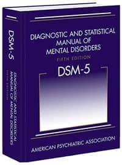
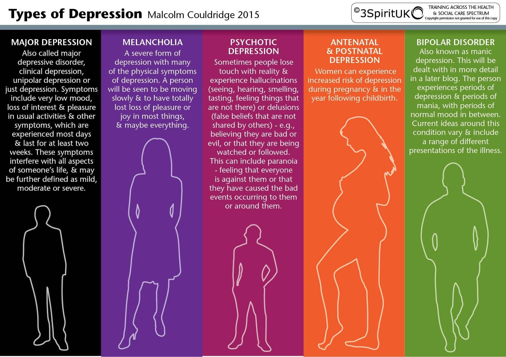
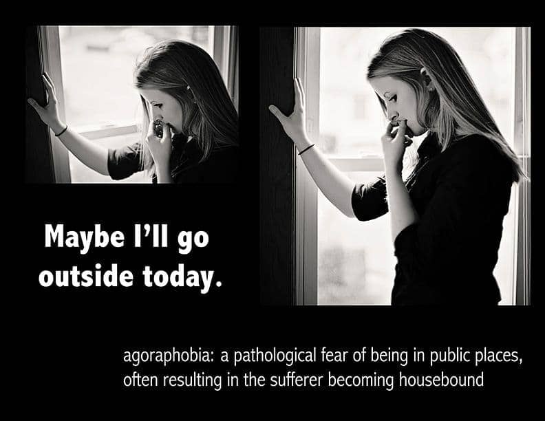
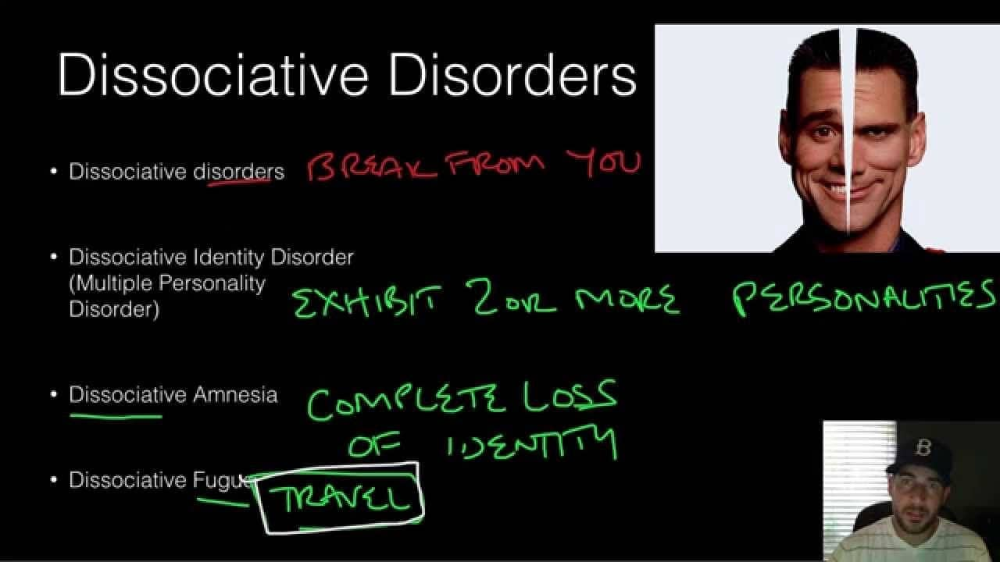
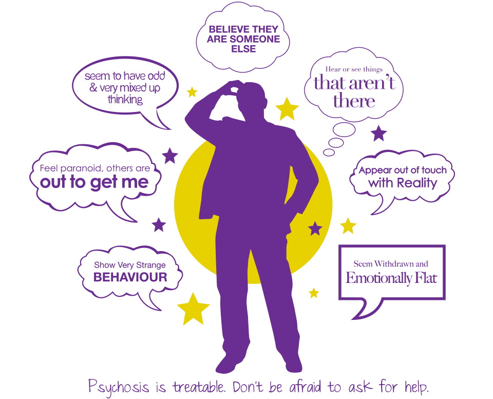
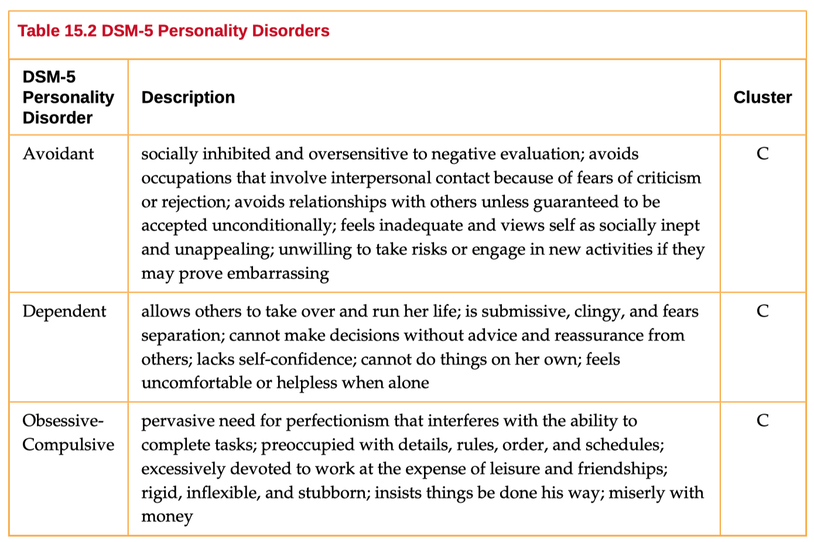
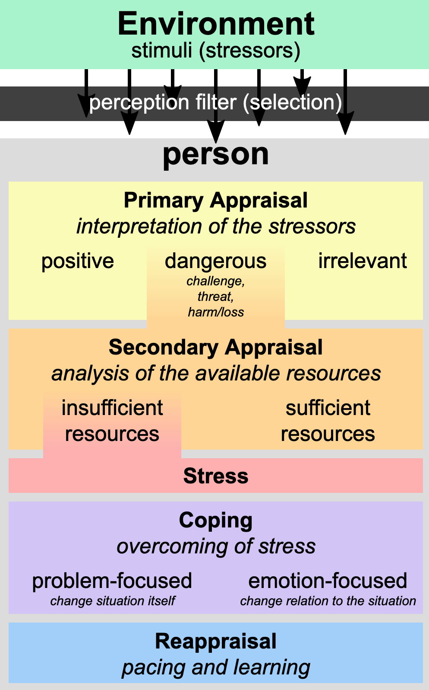
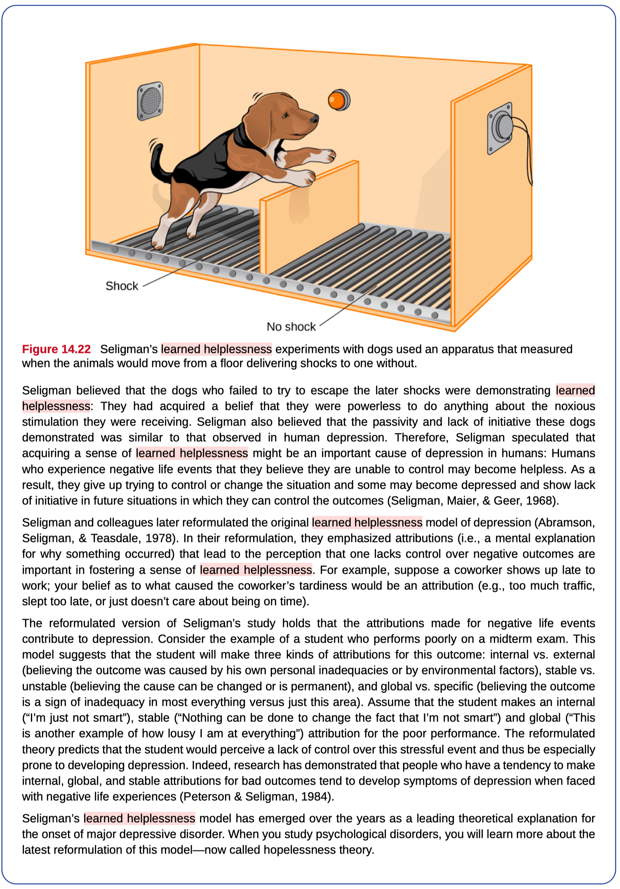

# 10. Psychological Disorders & Health (Ch 14 & 15)

### 10.1 Background and DSM-V

- Abnormal Psychology = Psychopathology

	- branch of psychology that deals with psychological disorders and mental illness
	- Includes study of symptoms, **etiology** (**causes**), and treatments

- Psychological Disorders

	- conditions characterized by abnormal thoughts, feelings, and behaviors, and

- DSM-V

	- The Diagnostic and Statistical Manual of Mental Disorders (5th Edition)
	- APA - American Psychiatric Association
	- Functional Impairments in multiple domains (eg, school, workplace, home, social, etc)

	

### 10.2 Affective Disorders (Mood/Emotion Disorders)

- Depression

	- sadness, loss of pleasure, hopelessness, worthlessness

- Types of depression

	- major depressive disorder
		- depressed mood most of the day, nearly every day
		- significant weight loss (when not dieting) or weight gain and/or significant decrease or increase in appetite
		- impacts people for a minimum of two weeks
	- seasonal pattern
		- a person experiences the symptoms of major depressive disorder only during a particular time of year (e.g., fall or winter)
		- In everyday language, people often refer to this subtype as the winter blues.
	- postpartum
		- women who experience major depression during pregnancy or in the four weeks following the birth of their child
	- persistent depressive disorder / dysthymia
		- depressed moods most of the day nearly every day for at least two years

	

- abnormal activity in brain

	- amygdala and prefrontal cortex
	- serotonin

- suicide and suicide risk
- diathesis-stress model

- cognitive theories

	- Beck’s negative cognitive triad

	

	- Hopelessness theory
	- rumination

- Bipolar disorder

	- mood states that vacillate between mania and depression

	

	- manic episode
		- last 7 days
		- increase activity and energy
		- flight of ideas
		- grandiosity, engaging in risky behaviors
		- can lead to involuntary hospitalization
	- 90% comorbidity rate
		- anxiety disorders and substance abuse
	- higher in men than women
	- high suicide rates
		- 36% attempt
		- 15-19% complete

### 10.3 Anxiety disorders

- Unusual feelings of dread, fearfulness or terror

- Generalized anxiety disorder (GAD)
	- excessive, uncontrollable worry
	- unaware of source
- Panic disorder
	- recurrent and unexpected panic attacks
	- racing heart, breathlessness, dizziness, shortness of breath
	- locus coeruleus-norepinephrine

- Obsessive-compulsive disorder (OCD)

	- repetitive thoughts (obsessions) that provoke anxiety
	- lead to repetitive behaviors (compulsions)
	- orbitofrontal cortex: learning and decision making

	

- Hoarding Disorder

	

- Phobias

	- intense and irrational fears of specific objects or events
	- go to great lengths to avoid stimulus

- Agoraphobia

	- avoidance of places difficult to escape or receive help with panic attack
	- public transportation, crowds, closed spaces, etc.

	

- Social anxiety disorder

	- fear, anxiety and avoidance of social situations

### 10.4. Somatoform Disorders

- Physical symptoms with no medical explanation

	

- Hypochondriasis

	- preoccupied with bodily symptoms
	- fear of having disease or illness
	- can’t be reassured by doctors

	

- Conversion disorders

	- neurological symptoms with no medical cause

	

### 10.5 Dissociative disorders

-  Fragmentation of personality

  

- Dissociative amnesia

  - unable to recall personally relevant information

- Dissociative fugue

  - suddenly and unexpectedly can’t recall past or identity
  - may take on different identity
  - they suddenly wander away from their home, experience confusion about their identity, and sometimes even adopt a new identity

- Dissociative identity disorder (DID) / Multiple Personality Disorder 

	-  two or more distinctly different identities
	-  most report childhood trauma

-  Depersonalization / Derealization Disorder

	-  depersonalization
		-  detachment from whole self or aspects of self
	-  derealization
		-  detachment from world
		-  individuals, objects, surroundings
		-  feeling like in a fog or dream

	

-  Post Traumatic Stress Disorder (PTSD)

	-  experiencing a profoundly traumatic event leads to a constellation of symptoms
	-  Hypervidilant

### 10.6 Psychoses

- Symptoms that are breaks from reality

- Positive Symtoms of Schizophrenia

	- hallucinations

		- convincing sensory experiences in the absence of external stimuli

	- delusions

		- false beliefs despite contrary evidence
		- paranoid, grandiose or somatic

		

	

- Negative Symptoms of Schizophrenia

	- emotional flatness
	- nonresponsiveness
	- avolition - reduction of motivation and drive
	- alogia - reduction of speech
	- anhedonia - inability to experience pleasure
	- social withdrawal

- Motor Symptoms of Schizophrenia

	- Catatonia: odd movements and postures

- Cognitive Symptoms of Schizophrenia

	- Disorganized thinking
	- word salad

- Other psychotic disorders

	- schizoaffective
		- A mental health condition including schizophrenia and mood disorder symptoms
	- schizophreniform
		- a mental disorder diagnosed when symptoms of schizophrenia are present for a significant portion of the time within a one-month period
		- But signs of disruption are not present for the full six months required for the diagnosis of schizophrenia.
	- brief psychotic disorder
		- Less than one month
	- delusional
	- substance-induced

### 10.7 Personality Disorders

- Personality style that differs markedly from expectations of culture
- Pervasive and inflexible
- Conflict with others, difficulty maintaining relationships

- Cluster A: odd or eccentric
	- paranoid, schizoid and schizotypal personality disorder
- Cluster B: impulsive, dramatic, erratic
	- histrionic, narcissistic and borderline personality disorder, anitsocial personality
- Cluster C: nervous, fearful
	- avoidant, dependent and obsessive compulsive personality disorder (OCPD)

### 10.8 Theories of Psychopathology

- Supernatural perspective
	- historically believed-force beyond scientific understanding
	- black magic or possessed by spirits
- Biological perspective
	- genetic factors
	- chemical imbalances
	- brain abnormalities
- Diathesis-stress model
	- biological and psychosocial factors

### 10.9 Health, Stress and Coping

- Stress

	- perception and response
	- events appraised as threatening
		- primary appraisal
		- secondary appraisal

	

	

- Eustress

	- good stress

- Distress

	- over optimal level of stress
	- feel burnt out

- Stress and illness

	- can increase sensitivity to pain
	- immune system
	- psychological disorders
	- cardiovascular disorders

- Coping styles

	- problem-focused
		- trying to alleviate source of stress
	- emotion-focused
		- reappraisal: stressor construed differently

	

	- Social support
	- Stress-reduction techniques
		- exercise, meditation, biofeedback

### Quiz

- A man’s life has been filled with misfortune and tragic experiences that were unexpected, unavoidable, and unpredictable. He is depressed and tells his therapist that he feels he cannot control the outcome of the events in his life. Which of the following best explains his depression?

	- **(A) Learned helplessness**
	- (B) Repression
	- (C) Operant conditioning
	- (D) Classical conditioning
	- (E) Biological rhythms

	

		

		

- Amy appears to have an irrational and maladaptive fear of flying. She will not fly to visit her children and grandchildren, and she has even lost a job because she refused to fly to meet clients. Amy would most likely be diagnosed with which of the following anxiety disorders?

	- (A) Generalized anxiety
	- **(B) Specific phobia**
	- (C) Social phobia
	- (D) Obsessive–compulsive
	- (E) Panic

- An obsession is defined as

	- (A) a senseless ritual
	- (B) a hallucination
	- (C) a delusion
	- **(D) an unwanted thought**
	- (E) a panic attack

- Every day when Carlos leaves his apartment, he locks the door, walks to the corner, turns around, and returns to his apartment in order to check that the door is locked. He returns to check the door several times before finally crossing the street and going about his day. Carlos would most likely be diagnosed with which of the following conditions?

	- (A) Narcissistic personality disorder
	- (B) Panic disorder
	- (C) Generalized anxiety disorder
	- (D) Bipolar disorder
	- **(E) Obsessive-compulsive disorder**

- Personality disorders are characterized by which of the following?

	- (A) A fear of public places, frequently accompanied by panic attacks
	- **(B) Problematic social relationships and inflexible and maladaptive responses to stress**
	- (C) A successful response to neuroleptic drugs
	- (D) A deficiency of acetylcholine in the brain
	- (E) An increased level of serotonin in the brain

- Schizophrenia is similar to Parkinson’s disease because both disorders

	- (A) are classified as psychotic
	- **(B) involve an imbalance of the neurotransmitter dopamine**
	- (C) are treated with selective serotonin reuptake inhibitors (SSRIs)
	- (D) are caused by viral infections during infancy
	- (E) feature enlarged lateral ventricles

	

	

- A diagnosis of schizophrenia typically includes which of the following symptoms?

	- **(A) Delusions**
	- (B) Panic attacks
	- (C) Hypochondriasis
	- (D) Multiple personalities
	- (E) Psychosexual dysfunction

- A somatization disorder is characterized chiefly by

	- (A) changes in mood
	- (B) panic attacks
	- (C) agoraphobia
	- (D) changes in eating behavior
	- **(E) physical complaints**

- Erik Erikson’s and Sigmund Freud’s theories of personality development are most similar in that both
	- (A) emphasize the libido
	- (B) focus on adult development
	- (C) discount the importance of culture
	- **(D) are based on stages**
	- (E) view behavior as a continuum