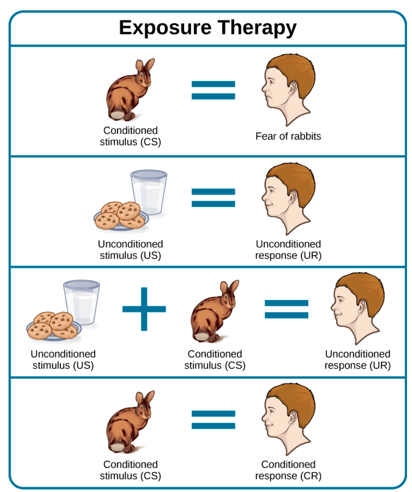
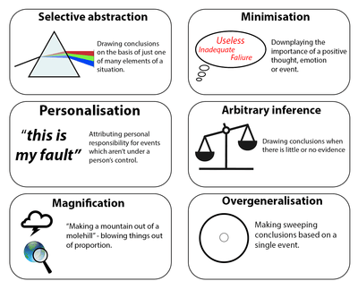
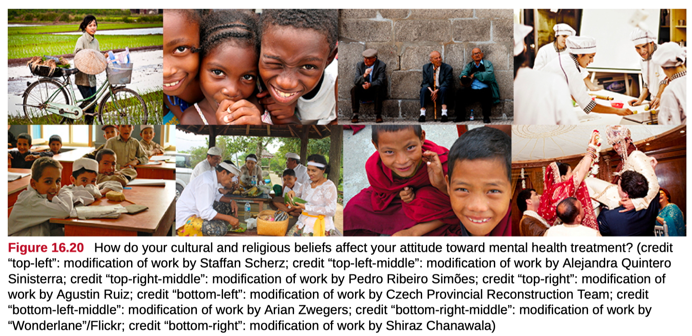

# 11. Treatment of Psychological Disorders (Ch 16)

### 11.1 Insight Therapies: Psychodynamic and Humanistic Approaches

- Psychodynamic

	- First practiced by Freud
	- Free-association
		- exploring the unconscious
		- says whatever comes to mind, no matter how trivial or embarrassing
		- reveal repressed and unconscious thoughts
		- insight and awareness
	- Resolution of past conflicts
	- Dream analysis
		- Manifest content: actual dream content
		- Latent content: meaning of dream

	

	- Insight and Catharsis
		- Insights: the congnitive shifts in awareness that are produced by the catharsis
		- Catharsis: release of emotions during psychodrama
	- Resistance
		- "I have nothing to talk about today."
		- coming late to a session
		-  not showing up to a session, 
	- Transference
		- the patient transfers all the positive or negative emotions associated with the patient’s other relationships to the psychoanalyst

	

	- Defense Mechanisms
		- Repression & Denail

- Humanistic

	- Client-centered therapy
		- Carl Rogers
		- active listening
		- non-directive
		- client makes interpretations, not therapist

	

	- Self-awareness and self acceptance
		- results in personal growth
	- Unconditional positive regard
	- Nonjudgmental

### 11.2 Biological and Drug Therapies

- Drugs or surgery to alter brain functioning

- Psychotropic medications

	- antidepressants
		- SSRIs (selective serotonin reuptake inhibitor)
		- prevent reuptake of serotonin

	

	- anti-anxiety

		- reduce arousal of central nervous system

	- antipsychotics

		- block dopamine

	- ECT - Electroconvulsive Therapy

		- Very severe

		

	- Deep Brain Stimulation

	

	- Psychosurgery
		- prefrontal lobotomy (no longer used)

### 11.3 Behavioral Therapies

- Behavior modification

	- a therapist employs principles of learning to help clients change undesirable behaviors

- Counterconditioning

	- a client learns a new response to a stimulus that has previously elicited an undesirable behavior
	- exposure therapy
		- systematic desensitization
		- flooding

	

	

	- aversive conditioning

	

	

- Token economy

	- individuals are reinforced for desirable behaviors with tokens, such as a poker chip, that can be exchanged for items or privileges
	- reward based

	

### 11.4 Cognitive Therapies

- How you think determines how you feel and act

- Change dysfunctional thoughts to relieve distress

- Cognitive distortion

	- **misinterpretation** of a situation

	

- Find a more positive, realistic outlook

### 11.5 Community and Preventative Approaches

- utilizing the resources of a community can be quite impactful to help alleviate or at least support those symptoms and those people suffering from psychological symptoms. 

- Behavior as an adaptation of resources and circumstances
- Individuals context in community and larger society
- Person-environment fit
	- political, cultural and environmental influences-cultural diversity
- Emphasis on strengths and competencies

### Quiz

- A treatment technique, often used to treat phobias, that builds upon the principles of classical conditioning is
	- (A) token economy
	- (B) rational-emotive behavior therapy
	- **(C) systematic desensitization**
	- (D) the placebo effect
	- (E) dream analysis
- Selective serotonin reuptake inhibitors (SSRIs) are used primarily in the treatment of which of the following?
	- (A) Antisocial personality disorder
	- (B) Schizophrenia
	- **(C) Depression**
	- (D) Mania
	- (E) Sleep disorders
- Which of the following kinds of therapy attempts to correct irrational beliefs that lead to psychological distress?
	- (A) Behavioral
	- **(B) Cognitive**
	- (C) Existential
	- (D) Gestalt
	- (E) Psychoanalytic
- A psychologist using Carl Rogers’ person-centered therapy strives to ensure that clients
	- (A) understand unconscious influences affecting their behavior
	- (B) develop positive thought patterns
	- (C) develop and use effective behavioral techniques
	- **(D) receive unconditional positive regard**
	- (E) understand their irrational beliefs