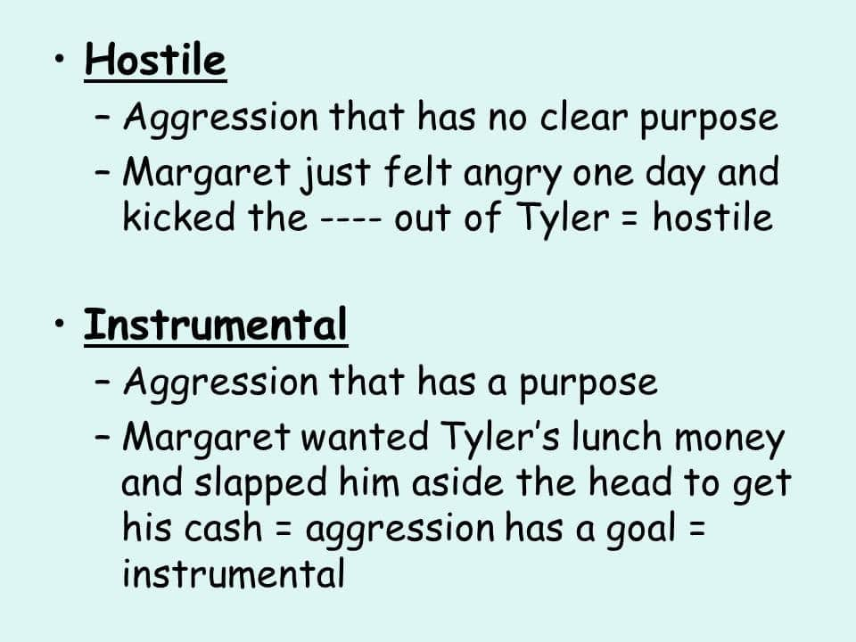
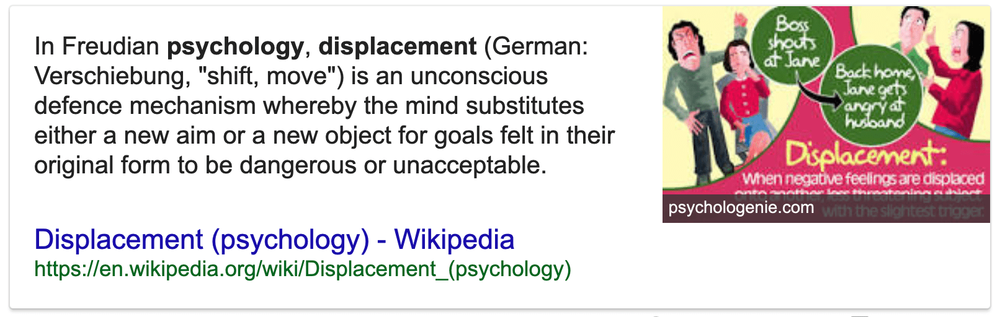

# 12. Social Psychology (Ch 12)

### 12.1 Attribution Processes

- Attribution theory

	- dispositional attributions
		- internal and trait reasons
		- personality or characteristics
	- situational attributions
		- external and state reasons
		- based on a person's situation or environement

	

	- fundamental attribution error

		- others behavior due to disposition, minimizing role of situation factors

		

	- actor-observer bias

		- viewing others faults as due to dispositional factors, but our faults as situationa

		

	- cognitive dissonance theory

		- psychological discomfort arising from holding two or more inconsistent attitudes, behaviors, or cognitions

		

		

### 12.2 Attitudes and Attitude Change

- Attitudes

  - **evaluation** or feelings towards **person**, **idea** or **object**
  - positive or negative; favorable or unfavorable
  - external and internal influences
  - affective, behavioral and cognitive

- Attitude Change

  - cognitive dissonance
    - internal influence
    - thoughts, feelings and behaviors in conflict

  - persuasion
    - process of changing our attitude toward something based on some form of communication
    -  foot-in-the-door technique

     

    - door-in-the-face technique

    

    - advertising

### 12.3 Interpersonal Perception

- Awareness of mental acts present within us

- Cognitive biases

	- Actor-observed bias (10.1)
	- Halo effect

	

	- False consensus

	

	- Psychological projection

	

### 12.4 Aggression/Antisocial behavior, and Altruism/Prosocial behavior

- Frustration-aggression hypothesis
	- it's believed that aggression is always the product of frustration
	-  frustration, basically always leads to aggression
- Hostile aggression
	- intent to cause pain
- Instrumental aggression
	- intent to achieve goal

- Testosterone

	- higher levels, more easily provoked

- Antisocial behavior

	- lack of remorse
	- no care for other people’s feelings
	- anger and hostility
	- affect expressed through aggressive acts

- Social learning theory

	- these elements of acting, behaving, can be learned

	

- Antisocial personality disorder

- Prosocial behavior

	- Altruism 
		- behavior aimed at helping others without expectation of reward or recognition
	- Bystander Effect
		- Kitty Genovese

	

### 12.5 Conformity, Compliance, Obedience

- Conformity

	- change in person’s behavior to go along with group
	- Solomon Asch Experiments
		- influence of group majority on individual’s judgment

	

- Motivation to Conform

	- normative social influence
		- conform to the group norm to fit in, to feel good, and to be accepted by the group
	- informational social influence
		- conform because believe the group is competent and has the correct information, particularly when the task or situation is ambiguous

	

- Compliance

	- going along with request or demand
	- desire to fit in, be liked and gain information about the group
	- groupthink: going along with others to form consensus, even if wrong/disagree
	- social loafing
		- individual performance drops in presence of group (e.g., tug-of-war)

	

	- social facilitation
		- performing better in presence of others (e.g., sports)

	

- Obedience

	- doing what an authority figure tells you to do
	- concerned about consequence if they do not comply
	- Stanley Milgram Experiments

	

 

### Quiz

- When insulted by a friend, Sally’s first impulse was to strike him. Instead, she yelled loudly and kicked a door several times. This means of reducing aggressive impulses exemplifies which of the following?

	- (A) Repression
	- (B) Fixation
	- **(C) Displacement**
	- (D) Conservation
	- (E) Sublimation

	

- Tameka regularly sets goals, plans for attaining those goals, and monitors her progress. Her activities are most closely associated with

	- (A) high extrinsic motivation
	- **(B) high achievement motivation**
	- (C) high extraversion
	- (D) low extrinsic motivation
	- (E) low achievement motivation

	

- Tom fails his math exam. If he explains his failure by using an internal attribution, his reason for failing might be which of the following?

	- (A) The teacher was unclear when presenting the material in class.
	- (B) Tom’s job did not leave him enough time to study.
	- (C) The person sitting next to Tom during the exam was very distracting.
	- (D) There was not enough time allotted to complete the exam.
	- **(E) Tom is not smart or not good at math.**

- Which of the following terms refers to the strategy of making a small request to gain listeners’ compliance, then making a larger request?

	- (A) Door-in-the-face
	- **(B) Foot-in-the-door**
	- (C) Social facilitation
	- (D) Matching
	- (E) Overjustification

- Similarity, proximity, and familiarity are important determinants of

	- (A) observational learning
	- **(B) attraction**
	- (C) sexual orientation
	- (D) aggression
	- (E) imprinting

	