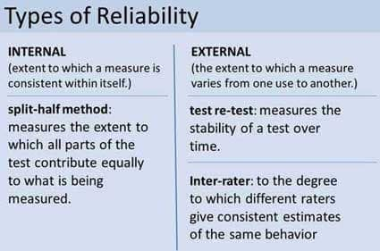

# 13. Statistics, Tests and Measurements (Ch2)

### 13.1 Descriptive and Inferential Statistics Samples, populations, norms

- Statistics
	- collection, analysis, interpretation, and presentation of numeric data
- Samples
	- representative subset of larger population
	- random sample
- Populations
	- group of people looking to study
- Norms
	- identifying normal behavior of group to compare to
	- standardizing
- Descriptive Statistics
	- used for correlational and experimental designs
	- measurements of behavior from sample
- Mean
	- average
- Mode
	- most commonly occurring score
- Median
	- middle score, separates lower and upper halves of scores
- Standard Deviation
	- statistical measure of how much scores in a sample vary around the mean
	- higher SD = more variability (more spread)
	- lower SD = less variability (less spread)
- Normal Distribution
	- bell curve showing symmetrical alignment of two variables (e.g Intelligence)
- Inferential Statistics
	- inferences about population based on characteristics of sample
- statistical significance
	- not likely to have happened by chance
	- significant equals 5% of the time or less

### 13.2 Reliability and Validity

- Reliability

  - stability and consistency of scores
  - does not need to be valid to be reliable

- Types of Reliability

  - test-retest reliability

  

  - internal consistency
  	- How well does a test correlate with itself
  - split-half reliability
  	- Cronbach’s alpha: avg correlation for every way a test can be split in half

  

- Validity

  - how well a test measures what it is supposed to measure
  - must be reliable to be valid

- Types of validity

  - face/content validity
  	- whether a test looks as though it is measuring what it is supposed to measure
  - predictive validity
  	- how well scores on the test predict the actual behavior of the type that the test is supposed to measure
  - construct validity
  	- whether the scores on a questionnaire are related in expected ways, either positively or negatively, to scores on other questionnaires that are proposing to measure the same thing.
	

- standardizing measures

### 13.3 Types of Tests

- Tests used to rule out chance
- t-test: computed for two means to see if they come from same population (e.g., of two groups or variables)
- ANOVA: analysis of variance

- Pearson correlation coefficient (-1.0 to +1.0)

### 13.4 Measurement of Intelligence

- Stanford-Binet Intelligence Scale
  - first IQ test
  - still widely used today
  - norming and standardization

- Wechsler Intelligence Tests
  - WAIS- IV: Adult
  - WISC-V: Children
  - WPPSI-IV: Pre-school and primary school

  

- Flynn effect
  - each generation, higher IQ

  

### Quiz

- Which of the following is a measure of central tendency that can be easily distorted by unusually high or low scores?
	- **(A) Mean**
	- (B) Mode
	- (C) Median
	- (D) Range
	- (E) Standard deviation
- Which of the following statistics indicates the distribution with the greatest variability?
	- A variance of 30.6
	- **(B) A standard deviation of 11.2**
	- (C) A range of 6
	- (D) A mean of 61.5
	- (E) A median of 38
- Which of the following is a true statement about the relationship between test validity and test reliability?
	- **(A) A test can be reliable without being valid.**
	- (B) A test that has high content validity will have high reliability.
	- (C) A test that has low content validity will have low reliability.
	- (D) The higher the test’s validity, the lower its reliability will be.
	- (E) The validity of a test always exceeds its reliability.
- If the null hypothesis is rejected, a researcher can conclude that the
	-  **(A) treatment effect was significant**
	- (B) theory must be modified, a new hypothesis formed, and the experimental procedure revised
	- (C) theory does not need modification, but the hypothesis and the experimental procedure need revision
	- (D) theory and hypothesis do not need modification, but the experimental procedure needs revision
	- (E) hypothesis is false
- In order to illustrate how often a particular score occurs in a given data set, researchers use
	- (A) inferential techniques
	- (B) cognitive mapping
	- (C) cluster analysis
	- (D) the median
	- **(E) a frequency distribution**