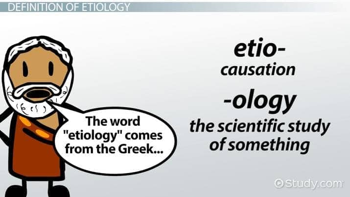
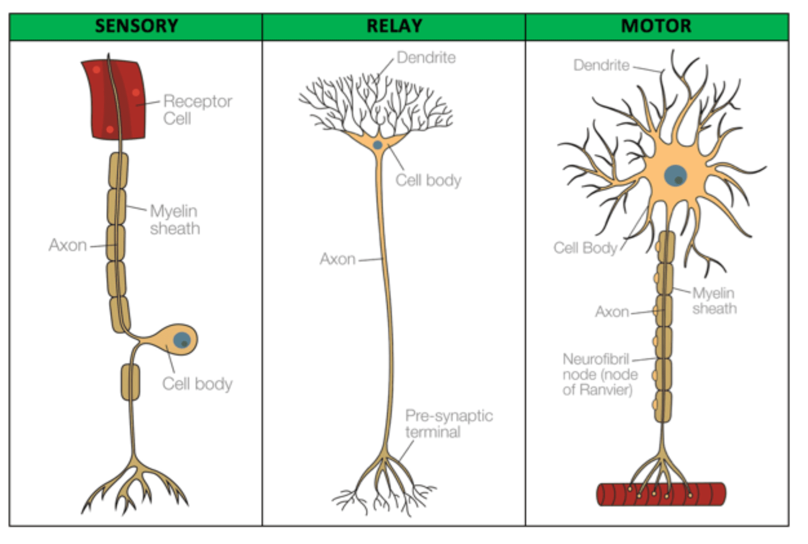
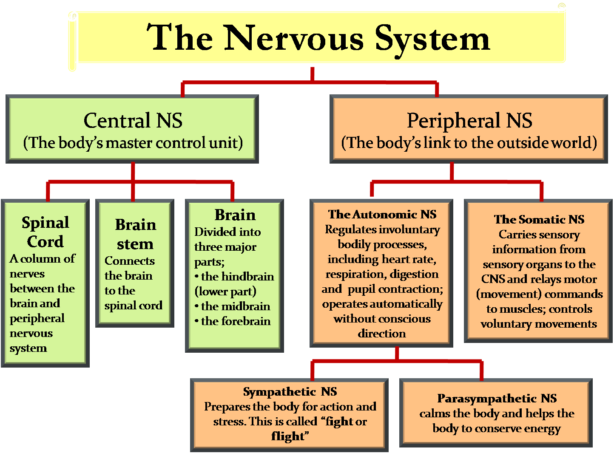
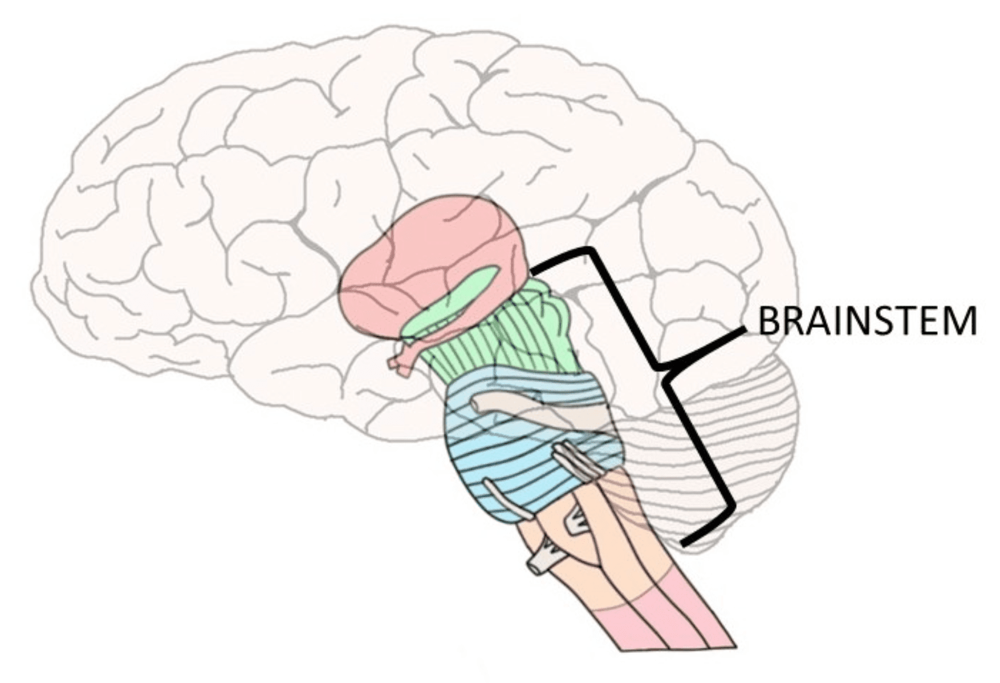
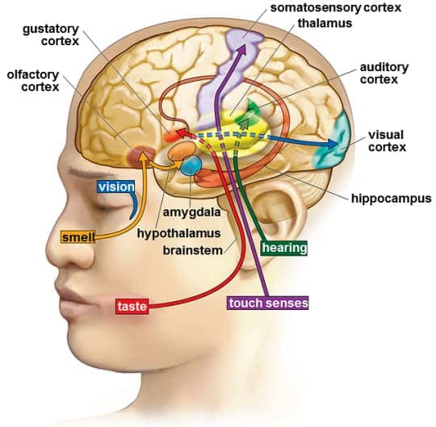

# 2. Biological Bases of Behavior (Ch 3)

### 2.1 Endocrine System

- Introduction
  - Made up of glands located throughout the body that **secrete** **hormones** into the bloodstream 
  - **Hormones** are **chemical messengers** secreted into the bloodstream to **regulate bodily functions**
  - Processes regulated include **metabolism, growth rate, digestion, blood pressure, sexual development and reproduction**

- Pituitary gland

  

  - **Master** **gland** of the endocrine system
  - When activated **by hypothalamus** activates **other** **glands** throughout the body

### 2.2 Etiology

- **Biological** explanation for **mental disorders** within psychology
- It's basically the **roots cause or origins** of what mental problems
- Genetic predisposition and hereditary links 
  - schizophrenia
  - alcoholism
  - bipolar disorder 
- Malfunctioning brain chemistry, neuroanatomic pathology

### 2.3 Functional organization of the nervous system 

- Communication throughout the nervous system takes place via neurons, cells that are highly specialized to receive and transmit information across the body

- Structure of Neurons

  

  - Cell body
    - helps keep the cell alive and functioning
  - Dendrites
    - take information in from outside of the cell
  - Axons
    - pass information along to other nerve cells, muscles or glands
  - Myelin sheath
    - covers the axon on some neurons (but not all)
    - accelerates the transmission of information

- Types of Neurons

  

  - Sensory/Afferent Neurons
    - take in information **from body tissues and sense organs**
    - transmit **to spinal cord and brain**
  - Inter/Association Neurons
    - neurons that communicate with **other neurons**
    - Most common
  - Motor/Efferent Neurons
    - send information **from spinal cord and brain** 
    - **to body tissue, muscles, and sense organs**

- Neurotransmitter

  - Neurons work through use of electrical impulses and neurotransmitters

    

  - Neurotransmitters are chemical molecules contained in vesicles within the axon terminal

  - Neurotransmitters communicate across the synapse gap (the space between two neurons)

  - Any neurotransmitter left in synaptic gap is **broken down** or **absorbed** **back** into the neuron which is called **reuptake**

  - Each neurotransmitter affects behavior differently

    - **Serotonin**: mood, emotional states, sleep
    - **Dopamine**: attention, movement, pleasure sensations

  - Drugs mimic behavior of neurotransmitter

    - Agonist: **increase** neural activity flow and effect
    - Antagonist: **decrease** neural activity and effect

- Nervous system

  - The nervous system is made up of different divisions that have unique functions

    

    

  - Central nervous system (CNS)

    - includes the brain and spinal cord
    - Suspended in cerebrospinal fluid
    - reflexive behavior
    - Relies on sensory, motor, and interneuron communication

  - Peripheral nervous system connects the brain and spinal cord to the rest of the body

    - Somatic nervous system
      - carries information from muscles, sense organs and skin to the CNS
      - carries messages from CNS to skeletal muscle 
    - Autonomic nervous system
      - controls internal environment of the body
      - glands, organs and some muscles
      - sympathetic nervous system prepares you for action
      - parasympathetic nervous system is in operation during states of relaxation

### 2.4 Genetics

- Genetics play a large role in **how and when learning, growing and development occur**
- Human behavior is a product of **genetics** and **environment**
  - nature vs nurture
- Genes do not determine behavior but can have a **significant impact on what we do and why we do it**

### 2.5 Neuroanatomy

- Introduction
  - Neurons in the brain work together as neural networks 
  - **Different parts** of the brain utilize **different functions** that influence thoughts, feelings and behaviors
  - Malfunctioning or damage in different areas of the brain impact their designated functions

  

- Brainstem

  - where the spinal cord enters the skull and is the oldest part of the brain

  

- Cerebellum

  - coordination of voluntary movement

  	

- Thalamus

  - on top of the brainstem, receives information about taste, touch, sight and hearing

  	

- Reticular formation

  - runs through thalamus and brainstem

  - controls arousal and sleep

  - filters incoming stimuli and sends to other parts of brain

    

- Limbic system

  - sits between brainstem and cerebral cortex-more recently evolved part of the brain

  - hippocampus: processes memory

  - amygdala: fear and anger

  - hypothalamus: hunger, thirst, sexual behavior; controls pituitary gland

  	

- Cerebral cortex

  - the outer covering of the brain

  - motor, cognitive and sensory processes

  - divided into 2 hemispheres and 4 regions

  - frontal lobes: coordinating movement, higher level functioning and speech

    - Broca’s area
    - Wernicke’s area

  - parietal lobes: sense of touch- hands and feet

  - temporal lobes: hearing

  - occipital lobes: vision

  	

### 2.6 Physiological Techniques

- Physiological techniques are used examine the interrelationship between a person’s brain and their behavior
	- EEG, MRI, FMRI, CAT scan, PET scan

### Quiz

- The term “etiology” refers to the study of which of the following aspects of an illness?
	- **(A) Origins and causes**
	- (B) Characteristic symptoms
	- (C) Expected outcome following treatment
	- (D) Frequency of occurrence
	- (E) Level of contagiousness
- A neuron is said to be polarized when
	- (A) it is in the refractory period
	- **(B) it is in a resting state**
	- (C) it is about to undergo an action potential
	- (D) the synaptic terminals release chemicals into the synaptic gap
	- (E) chemicals outside the cell body cross the cell membrane
- How many pairs of chromosomes are contained in most human cells?
	- (A) 7
	- (B) 10
	- (C) 16
	- **(D) 23**
	- (E) 31
- The release of a neurotransmitter into the synaptic cleft is caused by which of the following?
	- (A) An extended refractory period
	- **(B) An action potential**
	- (C) Reuptake of the neurotransmitter
	- (D) Binding of the neurotransmitter to a postsynaptic cell membrane
	- (E) Migration of vesicles into the synaptic cleft