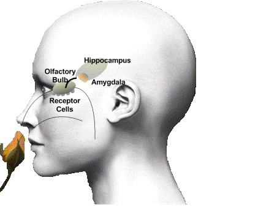

# 3. Sensory and Perception (Ch 5)

### 3.1 Attention

- Sensation
	- transforming energy from **outside stimuli** into **neural energy**
- Perception
	- taking **neural energy** and **creating an image** of outside world

- Psychophysics

	- **levels of intensity** we can **detect** **stimuli**
	- how sensitive we are to changes in stimulation
	- how psychological factors influence our ability to sense stimuli

- Psychological factors

	- **motivation**, **past experience** and **expectation** that impact our ability to notice stimuli
	- Signal detection theory: how people respond to different degress of stimuli
	- Important to detect differences between **stimuli** as well as their **absence** or **presence**

- Selective attention

	- The amount of **information we can hold** in our awareness is **less than** what **exists in the given environment**

	- Our ideas about reality are **chosen**, **organized** and **interpreted**

	- Perception is constructing meaning out of sensation

		

### 3.2 Other Senses

- Somesthesis is the body’s sense of touch and is broken down into three systems:

	- the skin sense: keep bodily fluids in and germs out
	- the kinesthetic sense: knowing how your body is moving **without visually observing ing**
	- vestibular sense: keeps the body balanced, **sense of balance**

- Olfaction is the body’s sense of smell

	- Chemical compounds of a specific “smell” travel through the nose to the brain
	- first processed by the **olfactory bulb**
	- Olfactory bulb has direct connections to **amygdala** and **hippocampus** which are strongly implicated in **emotion** and **memory**

	

- Gustation is the body’s sense of taste

	- Promotes **nutritional needs** and protects from **poisonous food**
	- **Bitter**, **sweet**, **salty**, **sour** and unami (**savory**) are the five main types of taste

- Vestibular system

	- sensory information pertaining to **motion**, **equilibrium** and **spatial orientation**
	- Located in each ear- utricle, saccule and three semicircular canals
		- utricle and saccule detect gravity and linear movement
	- **Keeps eyes on target** when head moves

	

### 3.3 Perceptual Development

- What is the origin of our capacities? Nature or upbringing?

- Ecological (nature)
	- some abilities are **present at birth** and **fine-tuning** of perceptual processes occurs throughout the lifespan
- Constructivism (nurture) 
	- construction of perception **through learning** and reliant on **specific experiences**

### 3.4 Perceptual Processes

- Depth Perception

	- allows us to **estimate distances** between ourselves and objects we see

	- binocular cues (both eyes): **Retinal Disparity**

		

	- monocular cues (one eye):  **Linear Perspective**

		

	- Motion parallax: the apparent movement of stable objects when we are moving

		

	- Interposition: when one object partially blocks out another

		

- Perceptual cues are hardwired but our experiences also shape our perception

	- sensory restriction: only has an effect in childhood when systems are forming
	- suggest a critical period for **certain perceptions to be developed**

- Processing of information occurs in:

	- bottom-up: simple sensory receptors to complex neural networks
	- top- down: expectations, motives and contextual cues to raw sensory data

### 3.5 Receptor Processes

- Vision allows for the processing of visual detail through use of the eyes
	- detects and interprets information from **visual light** 
	- **build representation** of the surrounding environment
- Audition is the process of taking in sound through the ear and having it travel to the brain
	- taken to **language center** of brain to be interpreted

### Quiz

- Damage to an individual’s parietal lobes is most likely to result in
	- (A) a heightened sense of smell
	- **(B) reduced sensitivity to touch**
	- (C) decreased reaction time
	- (D) a loss in the ability to understand spoken language
	- (E) difficulty discriminating between the four

- The picture above of a road receding in the distance represents the depth perception cue known as
	- (A) accommodation
	- (B) retinal disparity
	- (C) texture gradient
	- (D) relative size
	- **(E) linear perspective**
- Which of the following cortical areas is most closely associated with vision?
	- (A) Frontal

	- (B) Prefrontal

	- (C) Temporal

	- **(D) Occipital** 

	- (E) Parietal
- The receptors for hearing are the
	- (A) ossicles in the middle ear
	- (B) otoliths in the semicircular canals
	- **(C) hair cells on the basilar membrane**
	- (D) specialized cells on the tympanic membrane
	- (E) cells in the lining of the auditory canal
