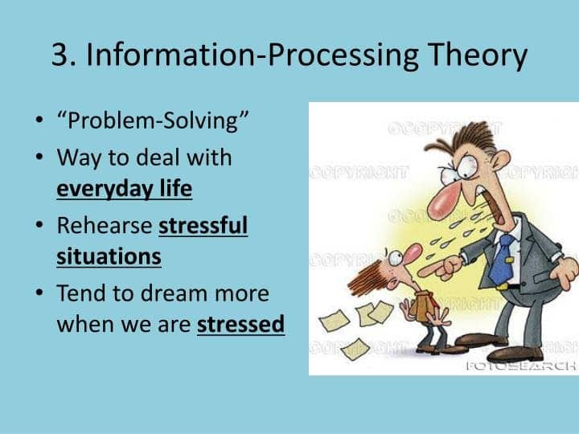

# 4. States of Consciousness (Ch 4)

### 4.1 Sleep and Dreaming

- Consciousness

  - A state of **awareness** about **ourselves** and our **environment**
  - Many varieties of consciousness, both **natural** and **induced**

- Circadian Rhythms

  - Body’s natural cycle of fluctuations of natural processes

  	- Temperature
  	- Hormone levels
  	- Level of wakefulness

  - About 25 hour clock when under “Free Running” conditions

  	

- Biological rhythms of sleep as measured by EEG

  - Five stages of sleep and differing brain waves

  - Stage 1: Alpha waves

  	- hypnogogic sensations

  - Stage 2: Theta waves

  	- sleep spindles
  	- K-complexes

  - Stage 3: delta waves

  - Stage 4: slow wave sleep

  - REM: paradoxical sleep

  	

  	

- Sleep disorders

  - insomnia
  - hypersomnia
  -  narcolepsy
  - sleep apnea

  

- REM rebound

  - **dreams** appear necessary
  - If REM deprived, longer periods will occur

- Theories about Dreaming

  - Freud’s theory of dreams
    - manifest content disguised as latent content

  

  - Activation-synthesis theory
    - Constructed story to explain images from random neural activation

  

  - Information-processing model
    - dreams are a way to consolidate information

  

### 4.2. Hypnosis and meditation

- Hypnosis

	-  induced state of consciousness

	- heightened state of motivation

	- **deep relaxation** and **heightened suggestibility**

	- dissociation: **split in consciousness**

		

		

- Meditation

	- heightening ones' awareness
	-  practice of **acknowledging content of the mind**
	- promote **relaxation**, **energy** and **compassion**

### 4.3. Psychoactive Drug Effects

- Produce a different state of consciousness by **mimicking**, **inhibiting** or **stimulating** activity of neurotransmitter

- Depressants: alcohol, barbiturates, opiates

- Stimulants: cocaine, amphetamines

- Hallucinogens: LSD, mescaline, psilocybin

	

### Quiz

- According to current psychological research, hypnosis is most useful for which of the following purposes?
	- **(A) Pain control**
	- (B) Age regression
	- (C) Treatment of psychotic behavior
	- (D) Treatment of a memory disorder
	- (E) Treatment of a personality disorder
- Which of the following drugs is most likely to cause hyperalertness, agitation, and general euphoria?
	- (A) A barbiturate
	- **(B) A stimulant**
	- (C) A hallucinogen
	- (D) An antidepressant
	- (E) An antipsychotic
- Brain waves during REM sleep generally appear as
	- (A) alternating high- and low-amplitude waves
	- **(B) rapid low-amplitude waves**
	- (C) irregular medium-amplitude waves
	- (D) slow low-amplitude waves
	- (E) slow high-amplitude waves
- According to the activation-synthesis hypothesis of dreaming, dreams serve which of the following purposes?
	- (A) To protect the ego from the unconscious struggles of the mind
	- **(B) To make sense of random neural activity during sleep**
	- (C) To provide unfiltered problem solving of encounters that occurred while awake
	- (D) To provide a window into the unconscious, revealing true wishes and desires
	- (E) To provide learning and rehearsal of material encountered while a person is awake