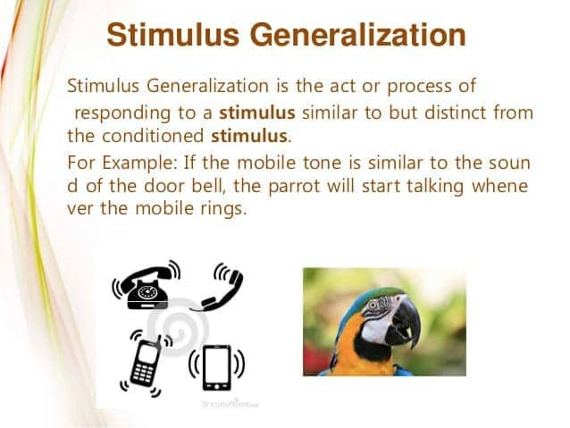
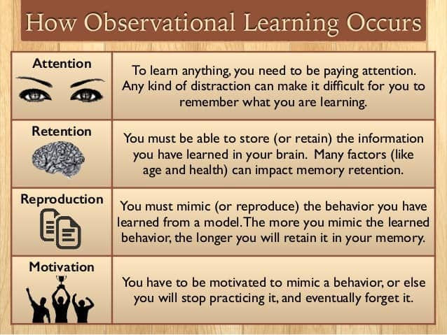
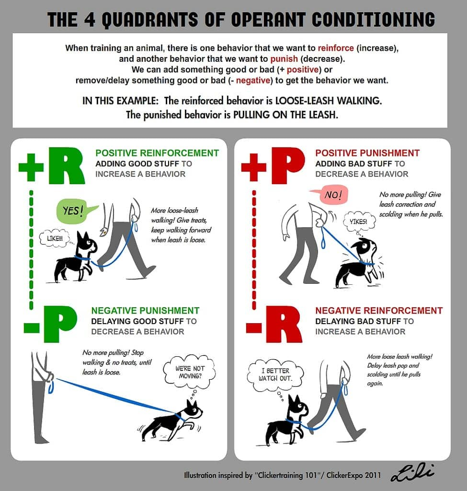
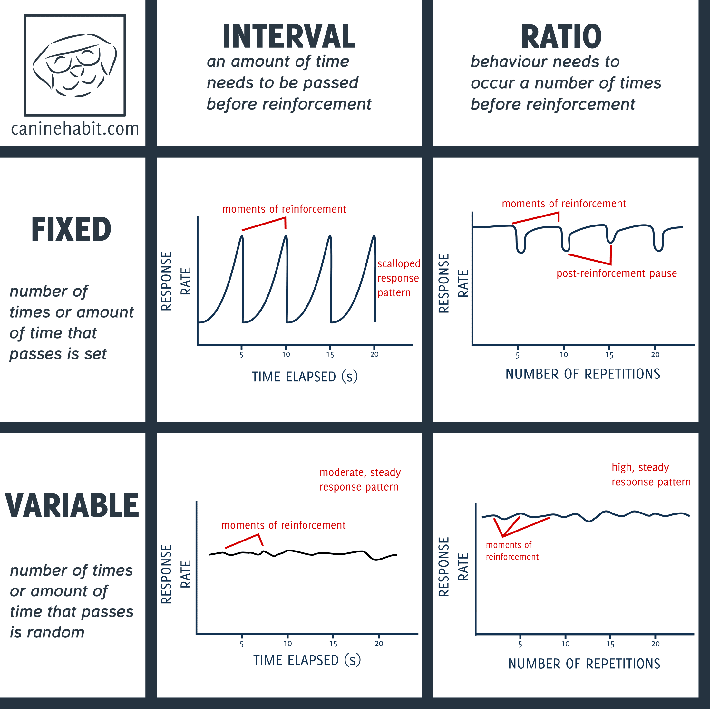

# 5. Learning

### 5.1 Biological Bases

- Unlearned behaviors one is born with

	- reflexes: motor or neural reaction
	- instincts: innate behaviors triggered by events

- help organism adapt to environment and survive

	

### 5.2 Classical Conditioning

- Ivan Pavlov's experiment
- Process of learning in which associate stimuli and, consequently, anticipated events
	- Unconditioned stimulus → unconditioned response
	- Neutral stimulus becomes conditioned stimulus
	- Conditioned stimulus → conditioned response

- Generalization

	

- Expectation

	- unconditioned stimulus will show up after conditioned stimulus

- Extinction

	- conditioned stimulus present without unconditioned stimulus
	- conditioned response goes away

### 5.3 Cognitive Process of Learning

- Complex interaction of conscious and unconscious processes

- Associative learning

	

	- Non-associative learning
		- habituation
		- sensitization

	

- Attention

	- Sensory register: holds information for a few seconds

	- Short-term and long-term memory

	- Encoding and retrieval of information

		

### 5.4 Observational Learning

- Modeling
	- watching what others do are say and mimicking behavior
- Learning occurs vicariously
- Albert Bandura' Experiment
	- attention, retention, reproduction, motivation
	- prosocial and antisocial effects

### 5.5 Operant Conditioning

- B.F Skinner: building off of classical conditioning
- Learning an association between a stimulus and response that follows it
- Based on Law of Effect:  positive consequence more likely to repeat behavior

- Reinforcement
	- Positive: something is **added** to **increase likelihood** of behavior
	- Negative: something is **removed** to **increase** **likelihood** of behavior
- Punishment
	- Positive: something is **added** to **decrease** **likelihood** of behavior
	- Negative: something is **removed** to **decrease likelihood** of behavior

- Reinforcement schedule

	- ratio schedule: how many times response has been made

	- interval schedule: amount of time between reinforcements

	- Fixed or variable

		

	

### Quiz

- After initial conditioning, an unconditioned stimulus is no longer presented with the conditioned stimulus, and the conditioned response gradually stops occurring. This change in behavior is called
	- **(A) extinction**
	- (B) counterconditioning
	- (C) higher-order conditioning
	- (D) stimulus discrimination
	- (E) stimulus generalization
- Research has shown that students generally perform better if tested in the same room where they originally learned the material. This shows the importance of which of the following in memory?
	- (A) Insight
	- (B) Preparedness
	- **(C) Context**
	- (D) Invariance
	- (E) Rehearsal
- Albert Bandura conducted a study in which a child viewed an adult playing with toys. The adult stood up and kicked and yelled at an inflated doll. The child was then taken to another room containing toys. When left alone, the child lashed out at a similar doll in the room. The child’s behavior toward the doll is most likely a result of
	- **(A) observational learning**
	- (B) operant conditioning
	- (C) classical conditioning
	- (D) authoritative parenting
	- (E) authoritarian parenting
- Making the amount of time a child can spend playing video games contingent on the amount of time the child spends practicing the piano is an illustration of
	- (A) frequency theory
	- (B) the law of association
	- (C) aversive conditioning
	- (D) classical conditioning
	- **(E) operant conditioning**