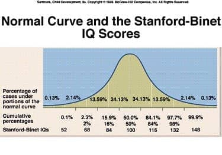
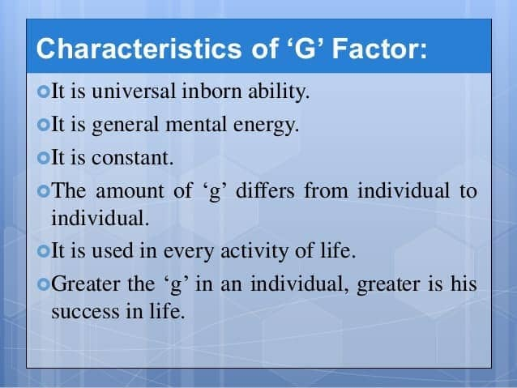
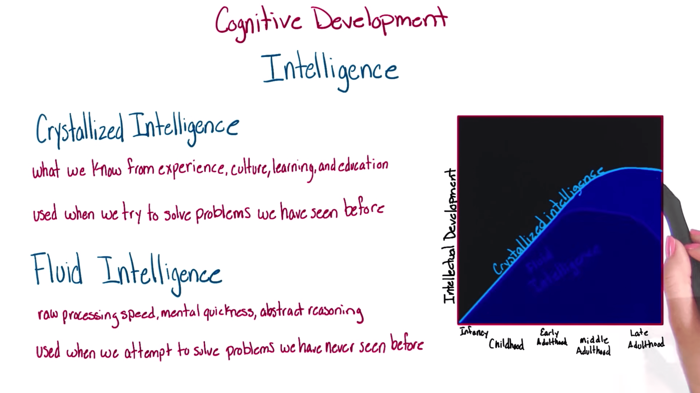
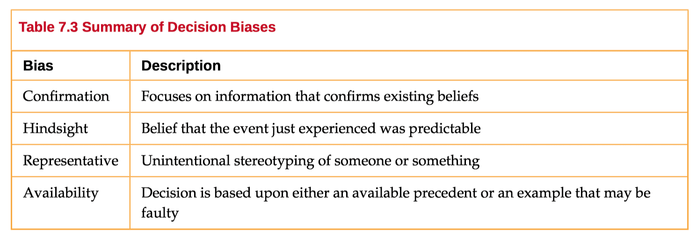

# 6. Cognition

### 6.1 Intelligence and Creativity

- Intelligence is our **inherent potential for learning**
	- How well you **solve problems**
- Alfred Binet
	- **first intelligence test**
	-  intelligence quotient (IQ)
	- comparison between test taker score and average

- g-factor theory of intelligence(Charles Spearman)

- Triarchic theory of intelligence (Robert Sternberg)
	- **analytic** intelligence (**academic** skills)
	- **practical** intelligence (**problem** **solving**)
	- **creative** intelligence

- Fluid intelligence (Raymond Cattell)
	- How fast you can **learn new things**
	- respond to your environment
	- **puzzle ability**
- Crystallized intelligence (Raymond Cattell)
	- Using **skills, experience and learned knowledge** to solve problems

- What leads to differing levels of intelligence?
	- Nature vs nurture
	- intelligence hereditary
	- learning environment
- Learning disabilities
	- dysgraphia
	- dyslexia

- Creativity
	- ability to **generate, create or discover new ideas, solutions and possibilities**
	- divergent thinking-“outside of the box”
	- facet of intelligence-difficult to measure objectively

### 6.2 Language

- Use of words and systematic rules to transmit information (and solve problems)
- Form of communication used uniquely by humans
- Way of getting ideas from one person to another
- Spoken, written or signed
- Components of Language
	- lexicon and grammar
	- phoneme and morphemes combined to form word
	- syntax and semantics used to construct language

- Noam Chomsky
	- Language Acquisition Device
	- Universal Built-in System

### 6.3 Memory

- Sensory memory
	- the memory system that is triggered by the various **senses** that we have
	-  lasts only **brief** moments, seconds and nanoseconds
- Short-term/working memory
	- information left in the mind **long enough to solve problems**
	- Capacity of **7 items +/- 2**
- Long-term memory
	- **extra effort** required to transfer from short-term
	- **Unlimited capacity**

- Mnemonic strategies
	- can be deliberate or unconscious
	- method of getting information into long-term memory or keeping more in short-term
	- rehearsal, chunking, spelling

### 6.4 Thinking and Problem Solving

- Heuristics

  - representativeness heuristic

    

  - availability heuristic

    

- Trial and Error

- Algorithm

- Problem solving pitfalls (Biases)
  - confirmation
  - hindsight
  - representative
  - availability

- Functional fixedness

  - become very limited in seeing the utility of things in my environment. 

  

### Quiz

- Priming is considered part of implicit memory because it
	- **(A) occurs without conscious awareness**
	- (B) often involves emotions
	- (C) helps in recognition but not in recall
	- (D) plays an important role in autobiographical memory
	- (E) requires deep encoding
- In problem solving, which of the following approaches almost always guarantees a correct solution?
	- (A) Insight
	- (B) Heuristic
	- **(C) Algorithm**
	- (D) Critical thinking
	- (E) Convergent thinking