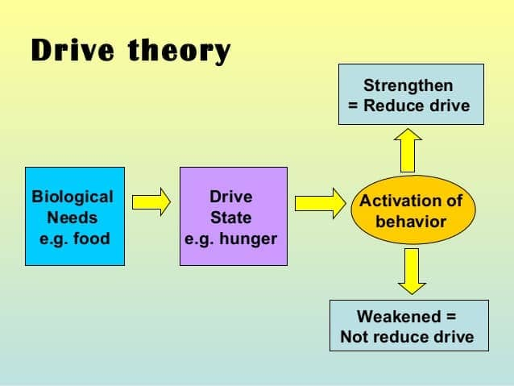
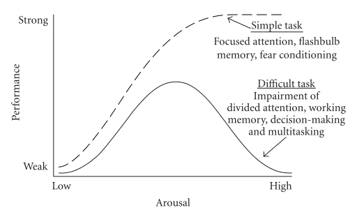
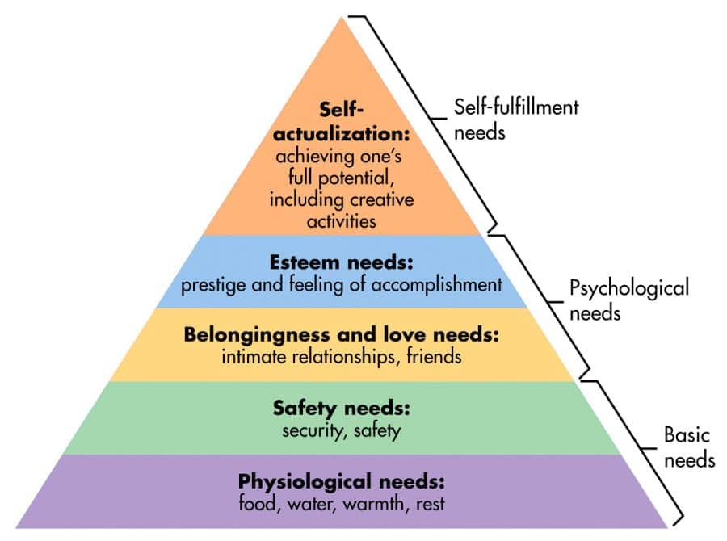
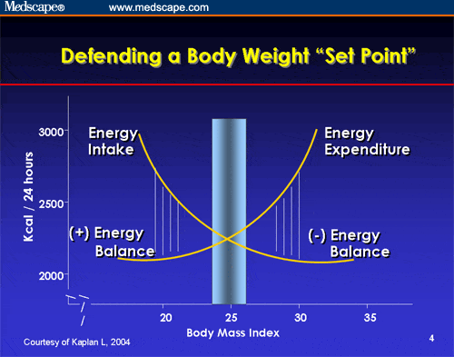
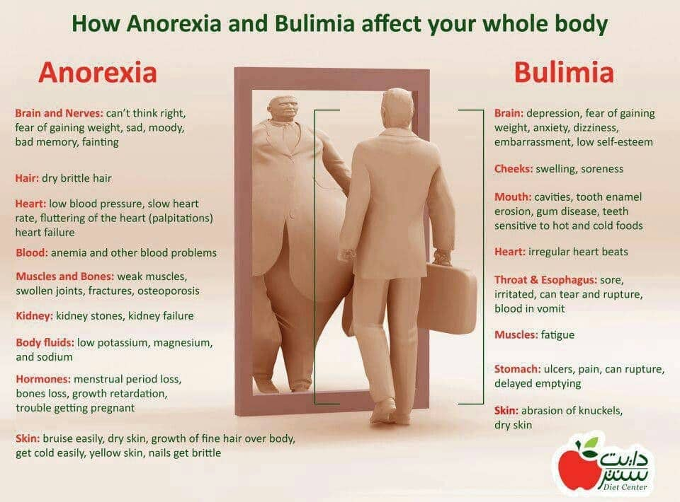
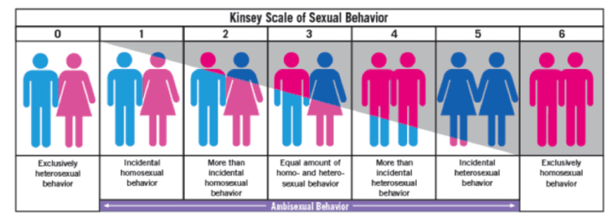
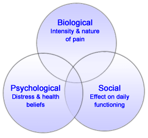
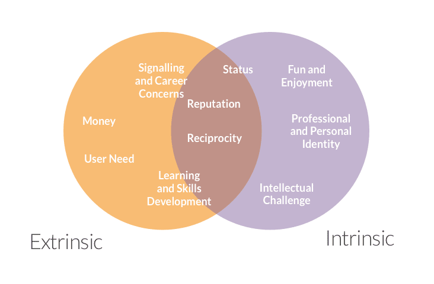

# 7. Motivation and Emotion (Ch 10)

### 7.1 Theories of Emotion

- Emotion: a **psychological state** involving three distinct components
	- subjective experience
	- physiological response
	- behavioral or expressive feature
- Mood
	- prolonged, less explicit, affective state
	- not usually determined by a single event

- James-Lange theory

	- **stimulus** causes arousal → emotion
	- **facial feedback** hypothesis

- Cannon- Bard theory

	- **relevant stimulus** generate arousal
	- information sent to **central nervous system and cortex**
	- "It's a cannon"

- Two-factor theory

	- quality of emotional experience depends on **how arousal is labeled**
	- excitation transfer

	

### 7.2 Theories of Motivation

- What drives us? What makes us behave as we do?

- Motivation

	- Describes the wants or needs that direct behavior towards a goal

- Drive theory

	- deviations from homeostasis create physiological needs to regain balance
	- e.g., no food → blood sugar⬇️ → hunger
	- habit- likely to engage in previous behaviors that met need

	

- Yerkes-Dodson law

	- optimal arousal levels depend on **complexity** and **difficulty** of task
	- complex task→ low arousal
	- simple task→ high arousal

- Maslow’s hierarchy of needs
	- physiological needs→ basic needs→ self-actualization
	- ongoing lifelong process

### 7.3 Biological Bases: Hunger, Thirst, Sex, Pain

- Hunger
  - biological instinct for survival
  - empty stomach → hunger pains and chemicals that initiate hunger in brain
  - glucose: blood sugar from food that provides energy for body
  - insulin: helps reduce glucose levels thus impacting hunger
  - hypothalamus

  

  

  - set-point: weight your body works to maintain

  

  - Eating Disorders
  	- social and cultural pressures for ideal beauty
  	- anorexia, bulimia, binge eating disorder

  

- Thirst

	- Produced by depletion of fluid outside and within cells
	- Peripheral and central nervous system
		- subfornical organ and lateral hypothalamic nucleus
	- Angiotensin: produced by the kidneys

- Sexual behavior

	- Sexual motivation from Limbic System
		- amygdala
		- nucleus accumbens

	

	- Hormones produced in endocrine system
		- estrogen (women)
		- testosterone (both)
	- Dr. Alfred Kinsey
		- Kinsey scale: used to categorize individual’s sexual orientation

	

	- Masters and Johnson
		- sexual response cycle: excitement, plateau, orgasm and resolution

	

- Biology of Pain

	- Nociception process
	- contact with stimulus
	- reception: nerve ending sense stimulus
	- transmission: relayed to central nervous system
	- pain center reception: brain further processes

- Types of Pain
	- Physical pain
		- physical characteristics, intensity and interpretation
		- acute vs chronic
	- Social pain
		- pain of social disconnection
	- Psychological pain
		- depression and other mental disorders

### 7.4 Social Motivation

- Human need to interact with others and be accepted by them
- extrinsic
	- receive something from others
- intrinsic
	- biological motives
	- sense of personal satisfaction

- Albert Bandura

	- We ultimately have a strong drive for self efficacy and that's what leads people to succeed
	- self-efficacy motivates behavior

	

### Quiz

- Stimulation of the lateral hypothalamus will result in which of the following behaviors in laboratory rats?
	- (A) An increase in sexual behavior
	- **(B) An increase in eating behavior**
	- (C) An increase in visual processing speed
	- (D) A decrease in auditory perception
	- (E) A decrease in memory functioning
- Which of the following is a disadvantage of relying on external rewards to motivate behavior?
	- (A) There is potential to reduce extrinsic motivation
	- **(B) There is potential to reduce intrinsic motivation**
	- (C) It increases fear of failure
	- (D) It increases fear of success
	- (E) It decreases competency
- One theory of the effects of arousal holds that efficiency of behavior can be described as an inverted U-shaped function of increasing arousal. Which of the following accurately describes this relationship?
	- (A) Greater arousal leads to better performance
	- (B) Greater arousal leads to poorer performance
	- **(C) Low and high levels of arousal lead to poorest performance**
	- (D) Overarousal leads to performance efficiency
	- (E) Underarousal leads to performance efficiency
- Which of the following presents a pair of needs from Abraham Maslow’s hierarchical need structure, in order from lower to higher need?
	- (A) Belongingness, safety
	- (B) Self-actualization, physiological needs
	- **(C) Physiological needs, safety**
	- (D) Esteem, belongingness
	- (E) Self-actualization, esteem
- Which of the following scenarios best illustrates the facial feedback hypothesis of emotion?
	- (A) Bill is a good card player who shows no emotion in his face that would reveal what he is thinking
	- **(B) Ellen says that hanging up the laundry on a clothesline makes her feel happy; she holds the clothespins in her teeth as she hangs each piece of clothing**
	- (C) Juanita fakes a smile to make her friends think she is happy
	- (D) Paul has been blind from birth and has never seen emotional faces, but he has emotional facial expressions similar to those of a sighted person
	- (E) As a result of Raj smiling at his customers, they smile at him

