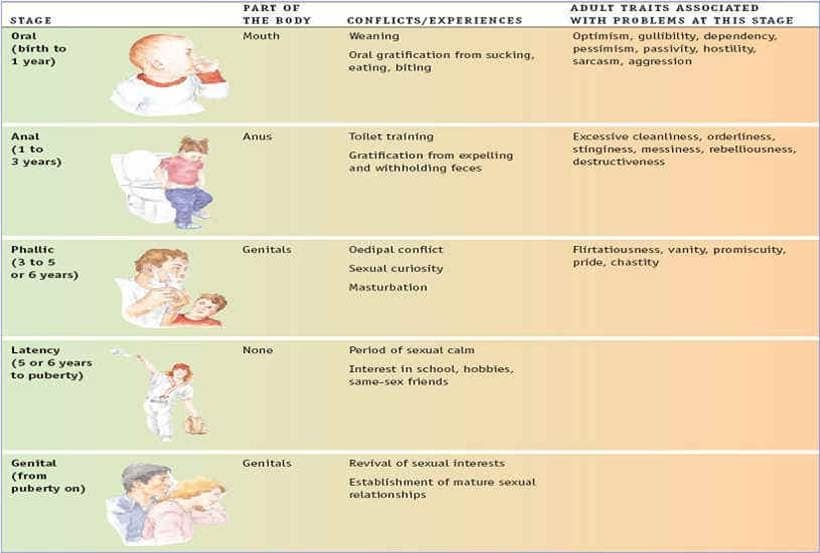
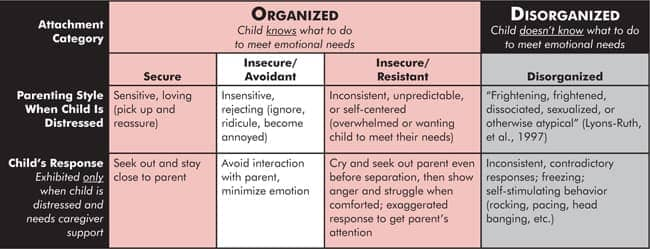
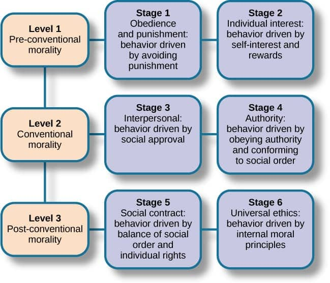

# 8. Developmental Psychology (Ch 9)

### 8.1 Research Methods: Longitudinal, Cross-sectional, Cross-sequential

- Cross-sectional

	- comparing people of **different ages** at same point in time
	- similarities due to context of a cohort can confound findings

	

- Longitudinal

	- tracking **single cohort (age group)** over **long period of time**
	- lose participants due to life circumstances or drop out
		- threatens validity of study

	

- Cross-sequential

	- people of **different ages** (like cross-sectional) are followed over **long periods of time** (like longitudinal)
	- helps to **reduce confounding variables**

	

### 8.2 Theories of development

- Piaget’s theory of cognitive development

  - sensorimotor: 0-2

    - knowledge through the **senses**
    - gradually acquire **object permanence**
  - pre-operational: 2-6

    - egocentric
    - use **symbolic thought**: words, images
    - **inability to understand conservation**
  - concrete operations: 6-12
  	- **logical** rules for concrete problems
  - formal operations: 12 +
  	- thinks **scientifically** and **hypothetically** about abstract principles

- Freud’s Psychosexual Theory

	- Oral: 0-1

		- **mouth** pleasure center-sucking reflex

	- Anal: 1-3

		- learn to control **bodily functions**
		-  toilet training

	- Phallic: 3-6

		- sexual desires towards **opposite sex** parent
		- Oedipus and Electra complex

		

	- Latency: 6-12

		-  sexual instincts subside
		- develop **superego** and conscious

	- Genital: 12+

		- **sexual impulses** reemerge

- Erikson’s Theory of Psychosocial Development

### 8.3 Dimensions of development: physical, cognitive, social, moral

- Physical

  - Infancy to childhood
  	- 5-7 lbs and 2-3 inches per year
  	- brain: 55% at age 2→ 90% at age 6
  	- motor development
  - Adolescence
  	- maturing of adrenal and sexual glands
  	- rapid increase in height
  	- menarche and spermarche
  - Adulthood
  	- Early - physical maturation complete
  	- Middle - gradual physical decline
  	- Late - last stages of physical change

- Cognitive

  - Infancy to childhood
  	- significant development of **cognitive abilities** and **thought processes**
  	- **language** and **communication** skills: partially inborn, partially learned
  - Adolescence
  	- more complex abilities: **processing speed and efficiency**
  	- more capable of **abstract** **thought**
  	- cognitive **empathy**
  - Adulthood
  	- complex, ever changing
  	- crystallized intelligence
  	- late: decline in fluid intelligence

- Social

  - Infancy to childhood

    - attachment theory by Bowlby:  avoidant, resistant, disorganized, secure

    

    

    

    - Sense of self and parenting style: authoritarian, authoritative, permissive, uninvolved

    

    

  - Adolescence

  	- form identity, pull away from parents
  	- peer relationships become central focus
  	- Social media

  - Adulthood

  	- need to have and find meaning
  	- define oneself based on career
  	- familial relationships central focus

- Moral: Kohlberg's stages of moral development

	- Infancy: right and wrong-what **feels good or bad**
	- Toddler: right and wrong-what **they are told by others**
	- Preschool: internalize **family values**, consequences of behaviors
	- 7-10: strong sense of “**should**” and “**should not**”
	- Preteen/teen: reason **abstractly** “right” and “wrong”, aware of larger society

### 8.4 Gender identity and sex roles

- Gender identity
	- sense of being male or female
	- gender dysphoria
		- discomfort identifying with one’s biological sex
		- 6 months (DSM 5)
- Sex/gender roles
	- sex role beliefs→ sex role stereotypes
		- ex: men are more aggressive, women more delicate
	- expected gender behaviors based on societal norms
	- sex role socialization
		- born male or female→ taught to be masculine or feminine

### 8.5 Heredity-environment issues

- Nature/Heredity
	- all genes and hereditary factors influence who we are
	- characteristics and traits are product of evolution
- Nurture/Environment
	- everything we are and know is based on experience
	- **behaviorism**: all or most behaviors result from **learning** and **conditioning**
- How nature and nurture interact, not one or the other

### Quiz

- In which of the following areas does research show most clearly that girls develop earlier than boys?

	- (A) Independence from parents
	- (B) Athletic competence
	- (C) Intellectual achievement
	- **(D) Adolescent physical growth spurt**
	- (E) Self-actualization

	

	 

	 

- Stella Chess and Alexander Thomas have classified temperament into which of the following clusters?

	- (A) Sensorimotor, preoperational, concrete operational
	- **(B) Easy, difficult, slow to warm up**
	- (C) Secure, insecure, resilient
	- (D) Authoritarian, authoritative, indulgent
	- (E) Preconventional, conventional, postconventional

- Developmental psychologists are most likely to prefer longitudinal research designs to cross-sectional research designs because longitudinal designs
	- (A) usually yield results much more quickly
	- (B) offer the advantage of between-subjects comparisons
	- (C) are much less likely to be influenced by cultural changes that occur over time
	- **(D) utilize the participants as their own experimental controls**
	- (E) are more valid

- Researchers know that infants’ sense of smell is fairly well developed at birth because newborns prefer the smell of
	- (A) sweet-smelling to the smell of sour-smelling foods
	- (B) meat to the smell of fruits
	- **(C) a nursing pad from their mother to the smell of a pad from another mother**
	- (D) an acid to the smell of a base
	- (E) a baby’s clothing to the smell of an adult’s clothing
- A young child breaks her cookie into a number of pieces and asserts that ‘‘now there is more to eat.’’ In Jean Piaget’s analysis, the child’s behavior is evidence of
	- (A) formal operations
	- (B) concrete operations
	- (C) conservation
	- **(D) preoperational thought**
	- (E) sensorimotor behavior

