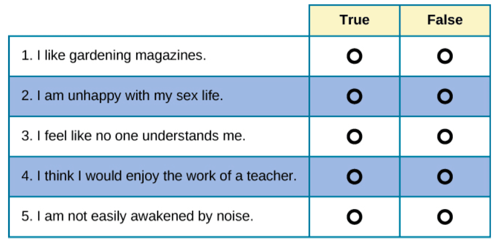
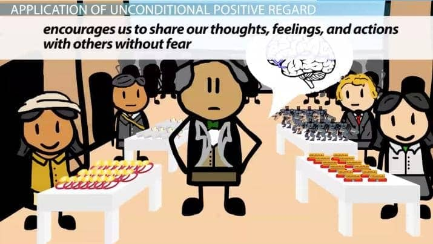
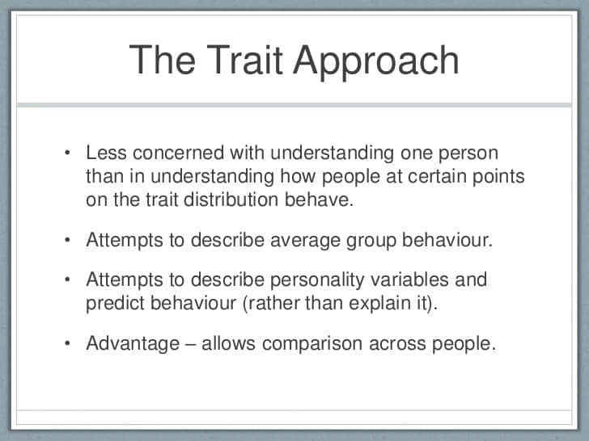

# 9. Personality

### 9.1 Assessment Techniques

- Self-report inventories (Ex: MMPI-2)

	- 587 questions
	- reliable and valid

	

	- lie scale: “faking good”

	

- Projective tests

	- projection to assess **unconscious**
	- Rorschach Inkblot Test

	

	- Thematic apperception test (TAT)

	

### 9.2 Growth and Adjustment

- Personality growth
	- proactive
	- conscious process
	- self-development
- Personality adjustment
	- reactive
	- coping with challenges of life
	- cultural components

### 9.3 Personality Theories and Approaches

- Psychoanalytic approach: Sigmund Freud

  - Motives behind behavior: sex and aggression

  

  - Id 
  	- biological
  	- pleasure principle
  	- "I want it, and I want it now"
  - Ego
  	- realistic
  	- reality principle
  	- "You cann't always get what you want"
  - Superego
  	- social
  	-  morality principle

  

  - Anxiety

    - conflict over how to behave
    - defense mechanisms
    - "I don't believe it, it can't be, it can't be true."
    - "No, I don't believe it."

  

  -  Psychosexual stages
  	- anal, oral, phallic, latent and genital
  	- Electra and Oedipal complex
  	- castration anxiety and penis envy

  

- Humanistic approach: Carl Rogers

	- Person-centered theory
	- Strive for Congruence:
		- Self concept: what we think we’re like
		- True self: talents, desires, thoughts and feelings we have
		- Ideal self: would like to be

	

	- Conditions of worth
		- imposed by parents
		- “must”, “should”
	- Unconditional positive regard
		- Empathic
		- Accepting and genuine

	

- Social-cognitive approach

	- How people think about themselves and relate to the world around them
	- Reciprocal determinism
		- how people think, behave and interact with their environment determines consistency of behavior
		- Cognitive dissonance

	

- Trait / Individual-difference approach

	- Measuring ways people differ
	- Self-report questionnaires

	

	- The Big Five (Five Factor Model)
		- factor analysis
		- OCEAN

	

### 9.4 Self-concept, Self-esteem

- Self-concept
	- self image, self consciousness
	- understanding of unchanging characteristic
	- social, physical, psychological
- Self-esteem
	- extent accept or approve of self
	- how much value self
	- reaction of others,comparison with others, social roles, identification

### 9.5 Research Methods: Idiographic, Nomothetic

- Idiographic approach
	- focus on what makes us unique
	- qualitative methods
		- case studies
		- informal interviews
		- unstructured observation
	- humanistic
- Nomothetic approach
	- focus on what we share with others
	- quantitative methods
		- experiment
		- correlation
		- psychometric testing
	- behaviorists, cognitive and biological

### Quiz

- The use of projective tests is associated with which of the following psychological approaches?
	- (A) Behaviorism
	- **(B) Psychoanalysis**
	- (C) Cognitive behaviorism
	- (D) Humanism
	- (E) Functionalism

- The key distinction between a personality trait and an attitude is
	- (A) centrality
	- (B) salience
	- **(C) durability**
	- (D) direction
	- (E) valence
- An attribution that focuses on an individual’s ability or personality characteristics is described as
	- (A) situational
	- (B) collectivist
	- **(C) dispositional**
	- (D) stereotypic
	- (E) homogeneous

- The case study method of conducting research is justifiably criticized because
	- (A) the researcher cannot focus on a specific individual
	- (B) the researcher cannot collect detailed observations
	- **(C) the results are difficult to generalize to a larger population**
	- (D) it does not allow for the generation of hypotheses that can be tested in future experiments
	- (E) it does not allow 