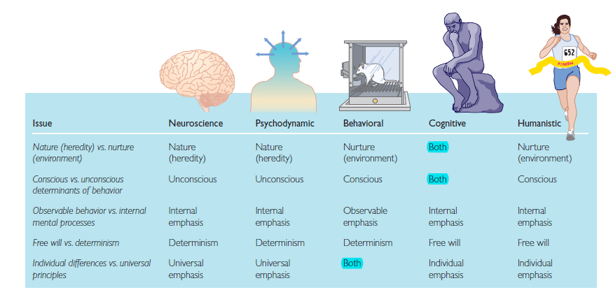
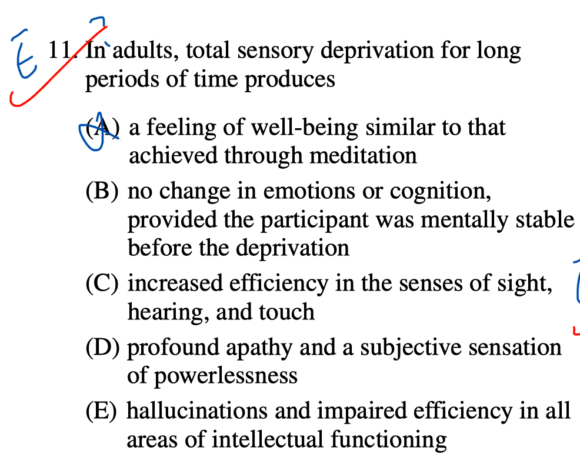
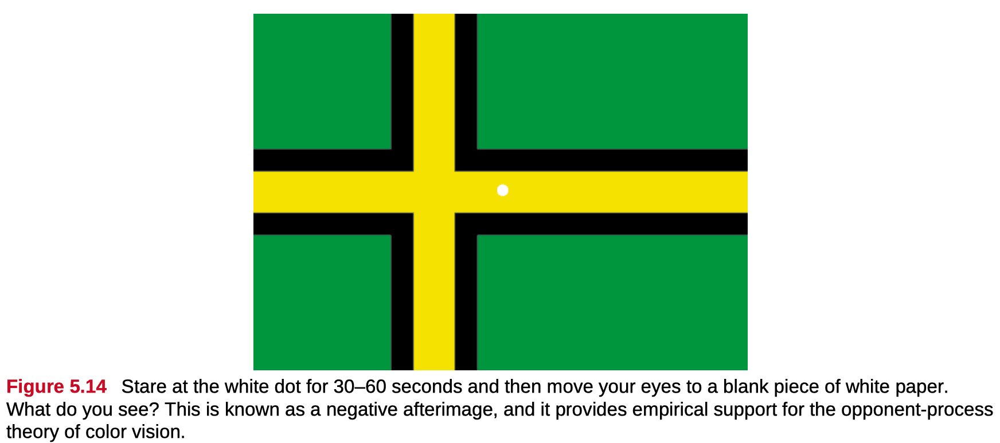
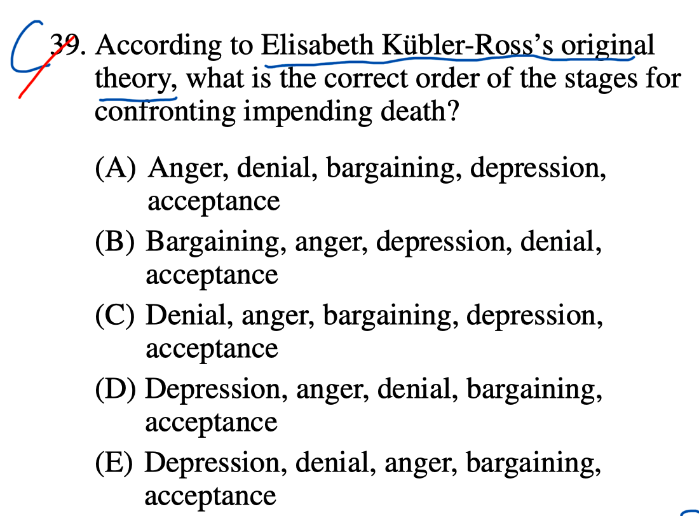

# Question 1

- Biological: genes, neurotransmitters
- Behavioral: external stimuli, environment, Pavlov's dog, learned and unlearned behaviors
- Psychodynamic: Sigmund Freud, childhood, id, ego, superego, projective test
- Cognitive: attention, language use, memory, perception, problem solving, creativity, thinking
- Humanistic: free will, self-actualization, Maslow's hierarchy of needs, inherently good

# Question 3

- Hermann Ebbinghaus: forgetting curve, memory, learning curve
- Hermann von Helmholtz: founder of experimental psychology
- William James: first educator to offer a psychology course in the United States, natural selection, functionalism
- Wilhelm Wundt: one of the founders of psychology, opened the Institute for Experimental Psychology at the University of Leipzig in Germany in 1879
- John Locke: a continuity of consciousness

# Question 4

- "Duty to inform" is a term used in law.

# Question 5

- An operational definition is a description of **how we will measure our variables**, and it is important in allowing others understand exactly **how and what a researcher measures** in a particular experiment.

# Question 7

- When a neuron is at rest, the neuron maintains an electrical **polarization**
- (i.e., a negative electrical potential exists inside the neuron's membrane with respect to the outside).
- This difference in electrical potential or voltage is known as the resting potential.
- At rest, this potential is around -70mV.

# Question 8

# Question 10

# Question 11

# Question 13

# Question 17

# Question 18

# Question 20

# Question 23

- Primary Reinforcer: An innately reinforcing stimulus like food or drink
- Secondary Reinforcer: A learned reinforcer that gets its reinforcing power through association with the primary reinforcer

# Question 25

# Question 26

# Question 32

# Question 34

- Stimulants are drugs that tend to **increase overall levels of neural activity**.
- A depressant is a drug that tends to **suppress central nervous system activity**.
- A hallucinogen is one of a class of drugs that results in profound **alterations in sensory and perceptual experiences**

# Question 37

# Question 39

# Question 41

# Question 45

# Question 47

