<a href="exams/[Peterson] Practice Test Question.pdf" target="_blank">Practice Test Question</a>

<a href="exams/[Peterson] Practice Test Solution.pdf" target="_blank">Practice Test Solution</a>

# Question 1

- biological psychologists (aka. behavioral neuroscience or biopsychology): examine the relationship of the **brain** and **nervous system** with behavior, and related areas such as cognitive processes and emotions
- experimental psychologists: employ human **participants** and **animal subjects** to study a great many topics
- comparative psychologists: the scientific study of the **behavior** and **mental processes** of **non-human animals**, especially as these relate to the phylogenetic history, adaptive significance, and development of behavior.
- animal psychologists: the scientific study of **animal** behavior, specialize in many different types of animals, including fish, bids, household pets, livestock, equine, or large wild animals
- physiological psychologists: a subdivision of **behavioral neuroscience** (biological psychology) that studies the **neural mechanisms** of perception and behavior through **direct manipulation of the brains** of **nonhuman animal** subjects in controlled experiments

# Question 2

- biological psychology: how the structure and function of the **nervous system** is related to behavior
- evolutionary psychology: the **genetic cause** of behaviors; predict the outcome of a behavior in a particular situation based on **evolutionary theory**
- cognitive psychology: focuses on studying **cognitions**, or **thoughts**, and their relationship to our experiences and our actions
- developmental psychology: the scientific study of development **across a lifespan**; interested in processes related to physical maturation
- personality psychology: patterns of thoughts and behaviors that **make each individual unique**; identifying **personality traits**, measuring these traits, and determining how these traits interact in a particular context to determine how a person will behave in any given situation
- social psychology: how we **interact with** and **relate to others**
- Industrial-Organizational psychology: applies psychological theories, principles, and research findings in **industrial and organizational settings**; make the best **hiring decisions** as well as to create an environment that results in high levels of employee **productivity** and **efficiency**
- health psychology: how **health** is affected by the interaction of biological, psychological, and sociocultural factors
- sport and exercise psychology: study the psychological aspects of **sport performance**, including motivation and performance anxiety, and **the effects of sport** on mental and emotional wellbeing
- clinical psychology: focuses on the **diagnosis** and **treatment** of psychological disorders and other problematic patterns of behavior
- counseling psychology: focuses on **emotional, social, vocational, and health-related outcomes** in individuals who are considered **psychologically healthy**
- forensic psychology: deals questions of psychology as they arise in the context of the **justice system**

# Question 6

- Replication involves repeating a study to determine whether the results are supported or whether they occurred due to chance.

# Question 7

- Psychoanalytic theory assumes that the unconscious plays a major role in human behavior.

# Question 8

# Question 10

# Question 12

# Question 13

- Corpus Callosum: connects the right and left hemispheres of the brain; responsible for **transmitting** neural **messages between** both the right and left **hemispheres**

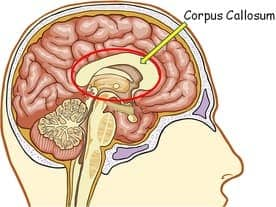

- Hypothalamus: responsible for behaviors such as **hunger and thirst**, as well as the maintenance of **body temperature**; responsibly for motivational behavior; controls the **pituitary gland**, which is the master gland that controls all the other endocrine glands in the body

- Limbic System: a complex system of nerves and networks in the brain, involving several areas near the edge of the cortex concerned with **instinct** and **mood**. It controls the basic **emotions** (fear, pleasure, anger) and **drives** (hunger, sex, dominance, care of offspring).

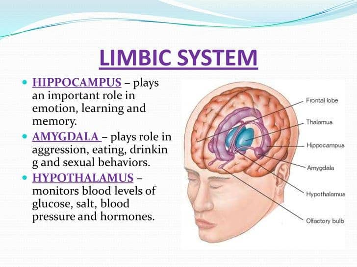

- Thalamus: Responsible for relaying information from the **sensory receptors** to proper areas of the brain where it can be processed; It diagnoses different sensory information that is being transmitted to the brain including auditory (relating to hearing or sound), visual, tactile (relating to touch),  and gustatory (relating to taste) signals. After that, it directs the sensory information to the **different parts and lobes of the cortex**.

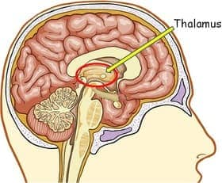

- Basal Ganglia: a group of subcortical nuclei, of varied origin, in the brains of vertebrates including humans, which are situated at the base of the forebrain; responsible primarily for **motor control**, as well as other roles such as **motor learning**, executive functions and behaviors, and **emotions**

# Question 14

- Reticular Activating System: **a diffuse network of nerve pathways** in the brainstem connecting the spinal cord, cerebrum, and cerebellum, and mediating the overall level of consciousness.

- Hippocampus: responsible for processing of long term memory and emotional responses 

# Question 15

- The sympathetic nervous system arouses the body and activates the “fight or flight” response.

# Question 16

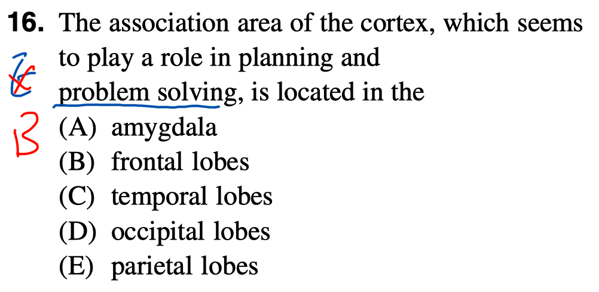

- The frontal lobes are responsible for higher thought processes.

# Question 18

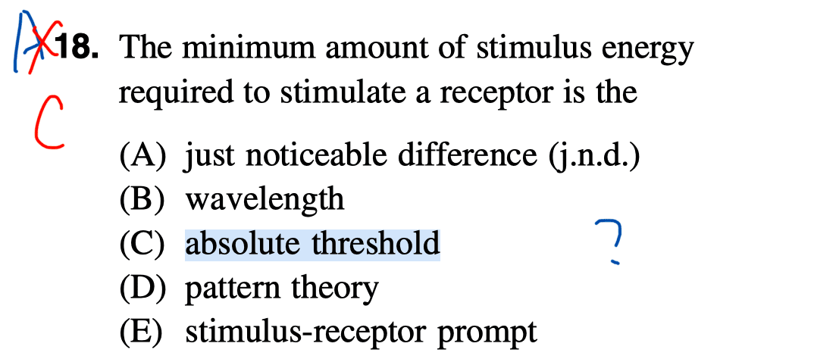

# Question 19

- If our eyes did not quiver, we would eventually no longer notice objects in our field of vision because of the principle of sensory adaptation.

# Question 21

- Taste is our least efficient sense, and much of it depends on smell.

# Question 22

- The semicircular canals are filled with fluid. Movement of the fluid provides feedback and helps maintain equilibrium.

# Question 24

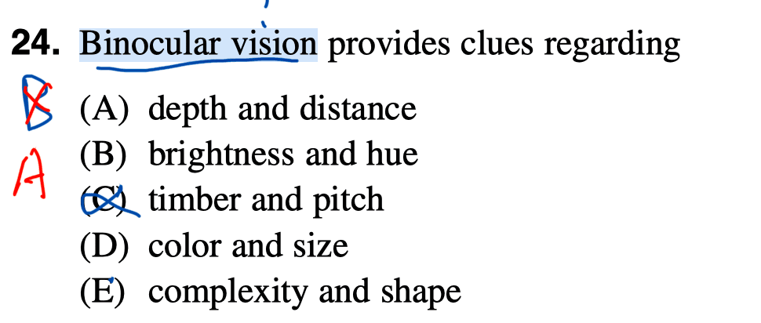

- Binocular vision supplies information on two characteristics, depth and distance. (“bi” means two, as in “binocular”). True depth perception requires the use of both eyes

# Question 27

# Question 28

# Question 29

- Delirium tremens are a sign of physical withdrawal from alcohol addiction. The “DTs” are marked by agitation, tremors, nightmares, and even hallucinations.

# Question 30

- Stimulants are drugs that tend to increase overall levels of neural activity
	- cocaine
	- amphetamines (including methamphetamine)
	- cathinones (i.e., bath salts)
	- MDMA (ecstasy)
	- nicotine
	- caffeine
- A hallucinogen is one of a class of drugs that results in profound alterations in sensory and perceptual experiences
	- Mescaline
	-  LSD
	- PCP (angel dust)
	- ketamine (an animal anesthetic)
- A depressant is a drug that tends to suppress central nervous system activity. Other depressants include barbiturates and benzodiazepines.
	- alcohol
	- barbiturates
	-  benzodiazepines

# Question 31

- Not everyone can be hypnotized, but for those who can, hypnosis can provide remarkable results. Caution should be exercised about accepting the validity of recovered memories, and hypnosis remains a controversial topic in psychology.

# Question 32

- Experiental knowledge, which could have its roots in principles of learning such as conditioning and reinforcement, underlies much of our learning.

# Question 34

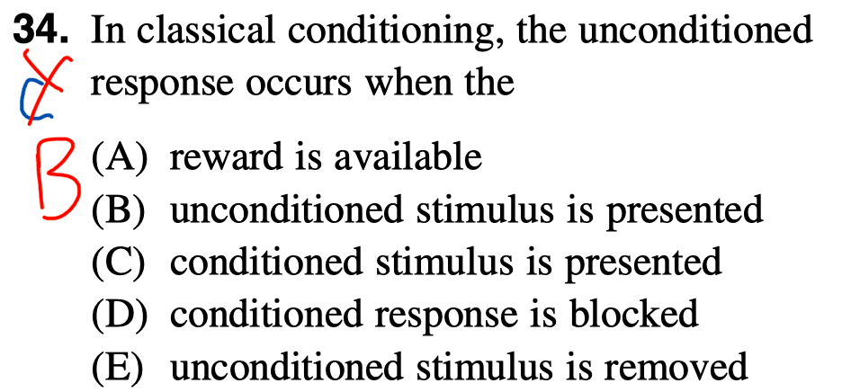

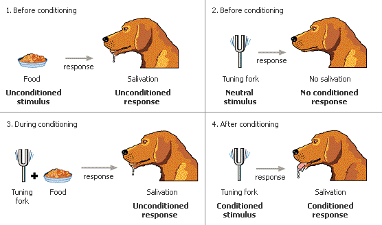

- In classical conditioning, the original, unconditioned response occurs upon presentation of the original, unconditioned stimulus.

# Question 35

- If the conditioned stimulus (CS) and the unconditional stimulus (UCS) are never presented together, the CS will lose its association to the UCS and will no longer elicit the conditioned response. This is called extinction.

# Question 36

- The child has learned to tell apart (discriminate) between his parents and his friends.

# Question 37

- Classical conditioning begins with unlearned (reflexive) behavior and pairs it with a new stimulus. In operant conditioning, the (voluntary) behavior comes first, and then it is followed by a reward, a punishment, or by no outcome.

# Question 40

- In behavior modification, behavior is changed by altering the rewards and punishments that are maintaining the behavior.

# Question 41

- Instinctual drift means that species-specific behaviors (instincts) sometime interfere with and over-ride learning. In this case, cats naturally like to investigate and survey their landscape from high places.

# Question 42

- According to the principle of extinction, when a behavior is no longer followed by reinforcement, the behavior decreases in frequency because it is no longer being maintained by reinforcers.

# Question 44

- Rehearsal is the intentional repetition of information in order to improve short-term memory.

# Question 45

- Recall: a form of remembering that requires the person to bring information out of memory without many retrieval cues.
- chunking: you organize information into manageable bits or chunks
- elaborative rehearsal: a technique in which you think about the meaning of the new information and its relation to knowledge already stored in your memory

# Question 48

- Babies are capable of making all the sounds used in all human languages.

# Question 50

- Although identical twins share 100 percent of genes, they are not identical beings. Environment does make a difference. However, identical twins are often reared in environments that are relatively similar in terms of intellectual development. Therefore, it is impossible to say what percent of their progress is the result of genes, and what percent is the result of their environments.

# Question 51

-  Validity answers the question “does the test measure what it originally set out to measure?”

# Question 52

-  All emotions have a physiological basis, cognitive awareness, a sense of goal-directedness, and possible changes in feeling.

# Question 53

# Question 54

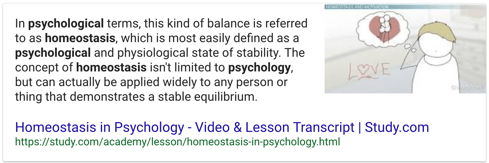

# Question 55

- Females have high levels of estrogen and males have high levels of androgens (e.g. testosterone.)

# Question 58

# Question 60

- teratogen: an agent or factor that causes malformation of an embryo.
- carcinogen: a substance capable of causing cancer in living tissue
- pathogen: a bacterium, virus, or other microorganism that can cause disease

# Question 61

# Question 63

- Secondary sex characteristics include the deepening of the voice in males, the growth of breasts in females, and the growth of body hair in both sexes. They are not essential for reproduction.

# Question 64

- Eating disorders result from a complex interaction of social and psychological factors.

# Question 65

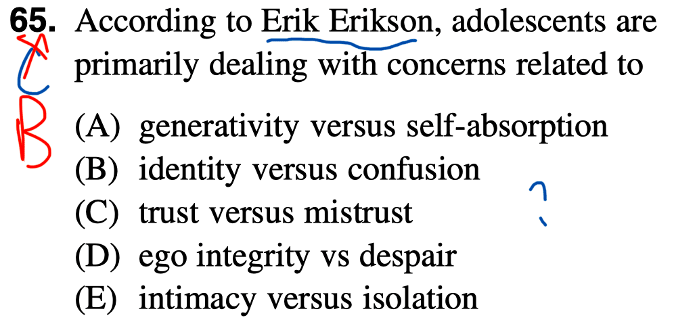

- Adolescents struggle with developing an identity of their own (positive outcome) vs. failing to establish a unique identity (confusion).

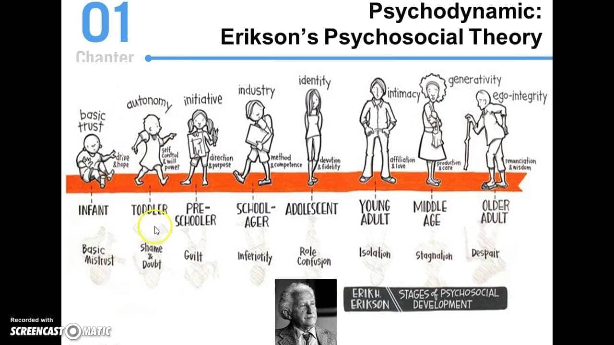

# Question 70

- The defense mechanism of identification protects the ego from unacceptable thoughts by identifying with the same-sex parent and giving up the desire to possess the opposite-sex parent.

 

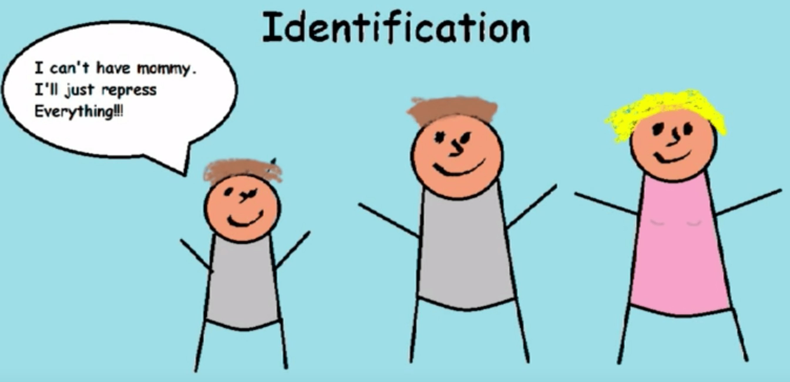

# Question 71

- Neo-Freudians
	- Alfred Adler
		- first major theorist to break away from Freud
		- individual psychology; inferiority complex
		- lack worth and don’t measure up to the standards of others or of society; our birth order shapes our personality
	- Erik Erikson
		- social relationships that are important at each stage of personality development
		- Erikson’s Psychosocial Stages of Development
	- Carl Jung
		- analytical psychology
		- balance opposing forces of conscious and unconscious thought, and experience within one’s personality
		- The **collective unconscious** is a universal version of the personal unconscious, holding mental patterns, or memory traces, which are common to all of us
		- extroversion and introversion
	- Karen Horney
		- each individual has the potential for self-realization and that the goal of psychoanalysis should be moving toward a healthy self rather than exploring early childhood patterns of dysfunction
		- Horney also disagreed with the Freudian idea that girls have penis envy and are jealous of male biological features
		- any jealousy is most likely culturally based, due to the greater privileges that males often have, meaning that the differences between men’s and women’s personalities are culturally based, not biologically based

# Question 72

- According to Carl Rogers, **unconditional positive regard** means accepting and valuing a person **regardless** of the person’s **behavior**.
- **Social approval** is the positive evaluation of an individual or group in a **social** context.

# Question 73

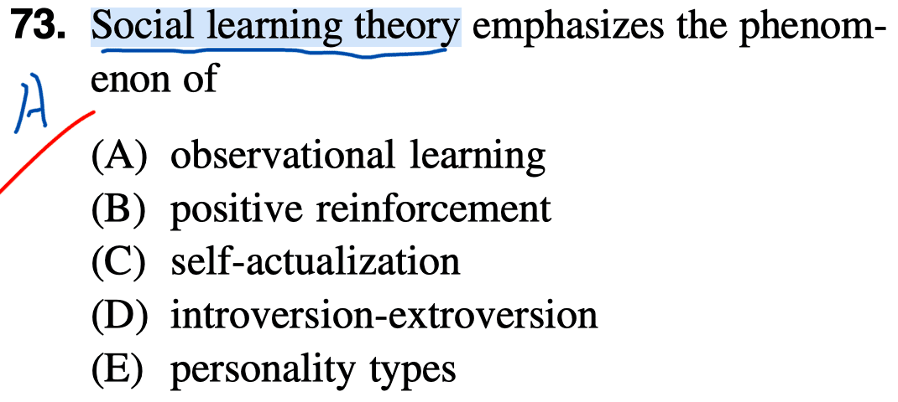

- Social learning theory was developed by Albert Bandura; it emphasizes observational, or vicarious, learning—also known as modeling.

# Question 74

# Question 75

- A sense of control is an effective buffer against stress. Social support is also important.

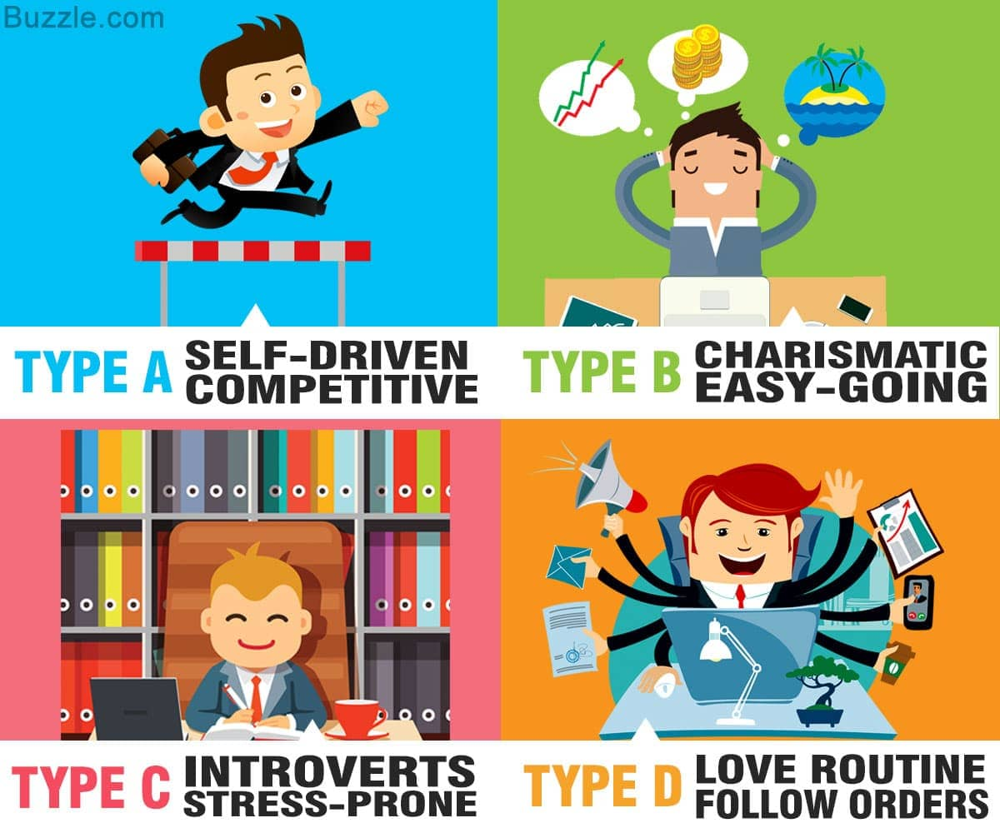

# Question 76

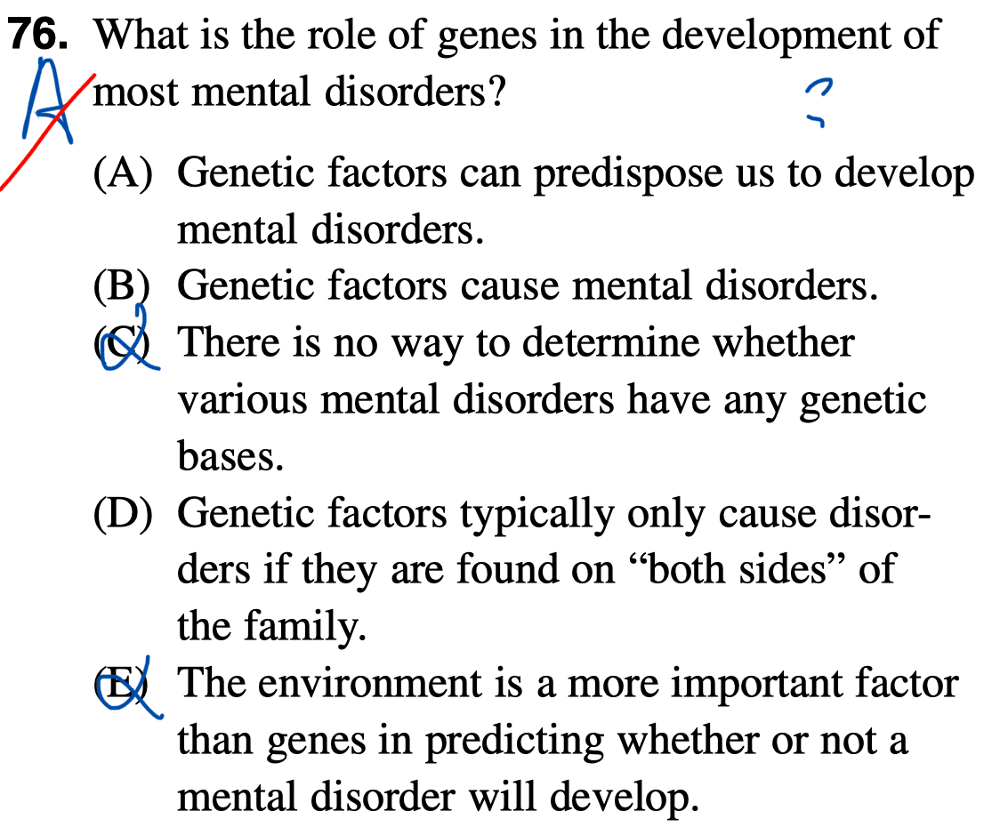

- Although not all mental disorders are biologically-based, many are, including schizophrenia, bi-polar disorder, some anxiety disorders, and depression in many people. Whether an individual with a biological predisposition actually develops a disorder depends on life experiences and coping skills.

# Question 77

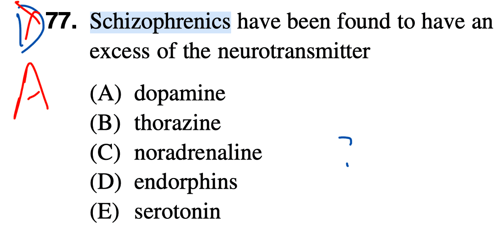

- Schizophrenics tend to have an excess of dopamine in certain areas of the brain.

- dopamine: a chemical released by neurons (nerve cells) to send signals to other nerve cells
- thorazine: primarily used to treat psychotic disorders such as schizophrenia
- noradrenaline: an organic chemical in the catecholamine family that functions in the brain and body as a hormone and neurotransmitter
- endorphins: reduce your perception of pain
- serotonin: help regulate mood and social behavior, appetite and digestion, sleep, memory, and sexual desire and function

# Question 78

- schizoid: emotional aloofness and solitary habits
- hysterical: deriving from or affected by uncontrolled extreme emotion
- manic: showing wild and apparently deranged excitement and energy
- anal-retentive: pays such attention to detail that it becomes an obsession and may be an annoyance to others

# Question 79

- Anxiety disorders are the most frequently occurring disorders and include generalized anxiety disorder, phobias, PTSD (post-traumatic stress disorder), and obsessive-compulsive disorder. Mood disorders are the second most frequently occurring disorders.

# Question 80

# Question 83

- Although modern psychodynamic therapists still regard early experience and unconscious conflicts as impor-tant, they are more likely to give weight to the patient’s social and cultural environment.

# Question 85

- In aversive conditioning, the therapist attempts to change the client’s **behavior** by pairing an undesirable behavior with an aversive (unpleasant) stimulus to decrease the behavior’s frequency.

# Question 86

- Systematic desensitization consists of constructing a fear hierarchy and gradually having the client progress through the hierarchy while practicing relaxation, which is incompatible with fear.

# Question 91

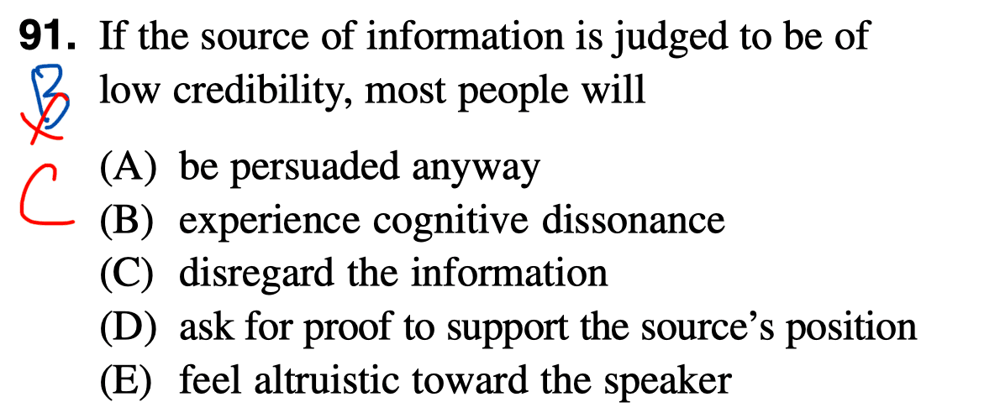

- A source with low credibility is not very persuasive.

# Question 93

- A self-fulfilling prophecy is a prediction that comes true not necessarily because it was correct, but more because it was made in the first place. Once people have an expectation about events, they tend to engage in behavior that increases the probability of the event’s occurrence.

# Question 95

# Question 96

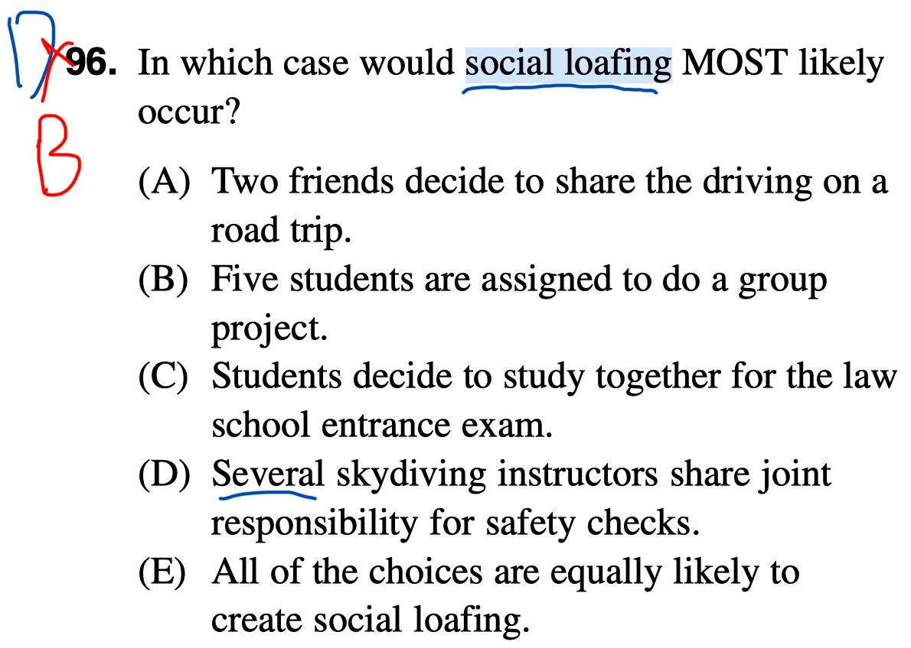

- Social loafing is most likely when there is no individual accountability of effort and all share equally in the outcome. Loafing is less likely as goals become more compelling.

# Question 97

