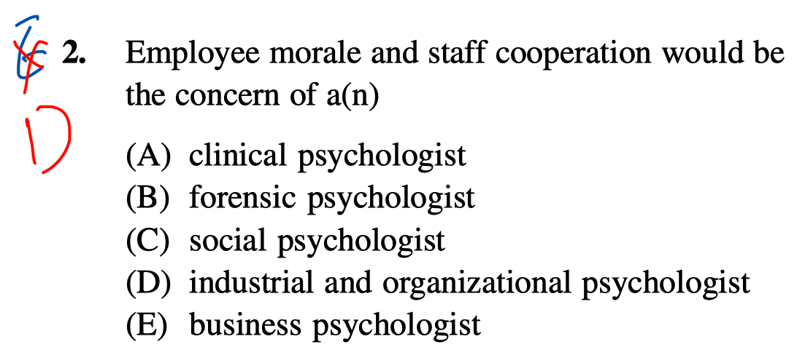
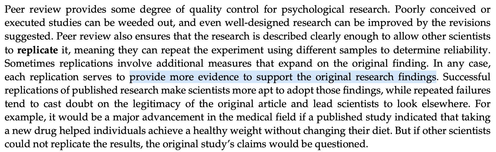

# Question 1

- biological psychologists (aka. behavioral neuroscience or biopsychology): examine the relationship of the **brain** and **nervous system** with behavior, and related areas such as cognitive processes and emotions
- experimental psychologists: employ human **participants** and **animal subjects** to study a great many topics
- comparative psychologists: the scientific study of the **behavior** and **mental processes** of **non-human animals**, especially as these relate to the phylogenetic history, adaptive significance, and development of behavior.
- animal psychologists: the scientific study of **animal** behavior, specialize in many different types of animals, including fish, bids, household pets, livestock, equine, or large wild animals
- physiological psychologists: a subdivision of **behavioral neuroscience** (biological psychology) that studies the **neural mechanisms** of perception and behavior through **direct manipulation of the brains** of **nonhuman animal** subjects in controlled experiments

# Question 2

- biological psychology: how the structure and function of the **nervous system** is related to behavior
- evolutionary psychology: the **genetic cause** of behaviors; predict the outcome of a behavior in a particular situation based on **evolutionary theory**
- cognitive psychology: focuses on studying **cognitions**, or **thoughts**, and their relationship to our experiences and our actions
- developmental psychology: the scientific study of development **across a lifespan**; interested in processes related to physical maturation
- personality psychology: patterns of thoughts and behaviors that **make each individual unique**; identifying **personality traits**, measuring these traits, and determining how these traits interact in a particular context to determine how a person will behave in any given situation
- social psychology: how we **interact with** and **relate to others**
- Industrial-Organizational psychology: applies psychological theories, principles, and research findings in **industrial and organizational settings**; make the best **hiring decisions** as well as to create an environment that results in high levels of employee **productivity** and **efficiency**
- health psychology: how **health** is affected by the interaction of biological, psychological, and sociocultural factors
- sport and exercise psychology: study the psychological aspects of **sport performance**, including motivation and performance anxiety, and **the effects of sport** on mental and emotional wellbeing
- clinical psychology: focuses on the **diagnosis** and **treatment** of psychological disorders and other problematic patterns of behavior
- counseling psychology: focuses on **emotional, social, vocational, and health-related outcomes** in individuals who are considered **psychologically healthy**
- forensic psychology: deals questions of psychology as they arise in the context of the **justice system**

# Question 6

- Replication involves repeating a study to determine whether the results are supported or whether they occurred due to chance.

# Question 7

- Psychoanalytic theory assumes that the unconscious plays a major role in human behavior.

# Question 8

