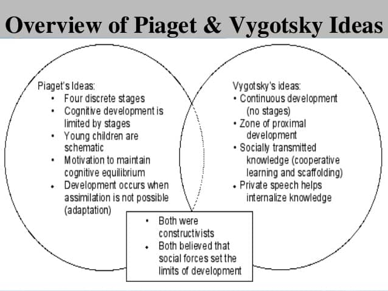
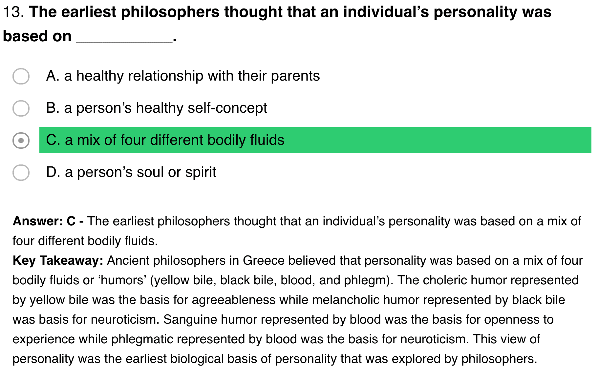
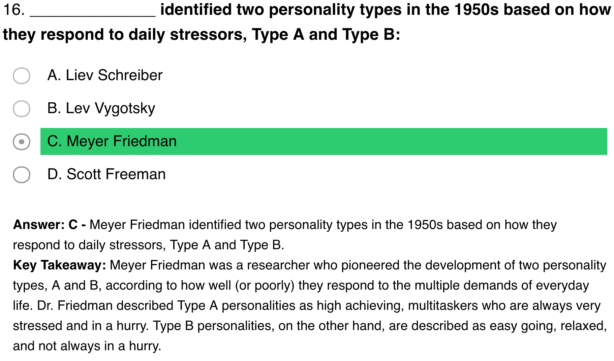
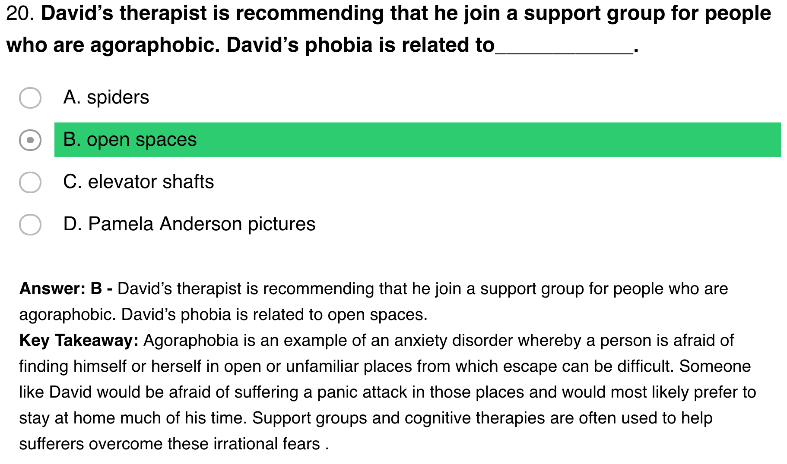

[Exam Link](https://www.practicequiz.com/clep-psychology-test-prep)

# Question 4

# Question 5

# Question 6

- Learning and memory are closely related concepts. 
- Learning is the acquisition of skill or knowledge, while memory is the expression of what you’ve acquired. 
- Another difference is the speed with which the two things happen. If you acquire the new skill or knowledge slowly and laboriously, that’s learning. If acquisition occurs instantly, that’s making a memory.

# Question 9

# Question 11

# Question 13

# Question 15

# Question 16

- Vygotsky's main work was in **developmental psychology**, and he proposed a theory of the development of "higher psychological functions" that saw human psychological development as emerging through **interpersonal connections and actions with the social environment**.
- Meyer Friedman (July 13, 1910–April 27, 2001) was an American cardiologist who developed, with colleague R.H. Rosenman, the theory that the **"Type A" behavior of chronically angry** and impatient people raises their risk of heart attacks.

# Question 18

# Question 20

