[Exam Link](https://www.proprofs.com/quiz-school/story.php?title=clep-introductory-psychology)

# Question 9

- Carries out and regulates life sustaining functions such as **breathing**, **swallowing** and **heart rate** 
- It's functions are **involuntary**, or done without thought.

# Question 11

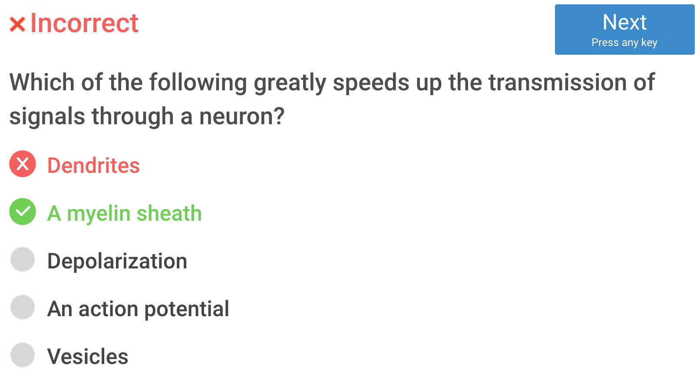

- The main purpose of myelin is to increase the speed at which electrical impulses propagate along the myelinated fiber
- In unmyelinated fibers, electrical impulses (action potentials) travel as continuous waves, but, in myelinated fibers, they "hop" or propagate by saltatory conduction.

# Question 12

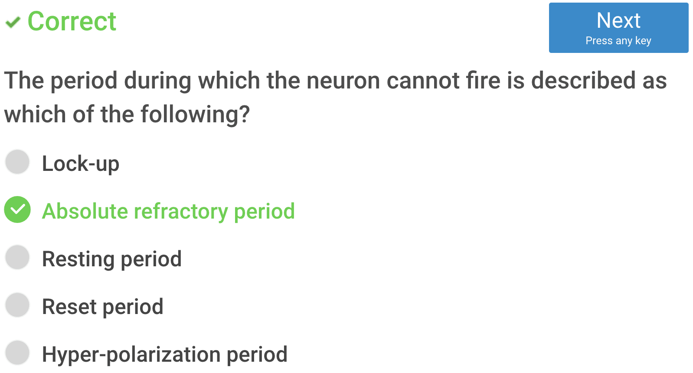

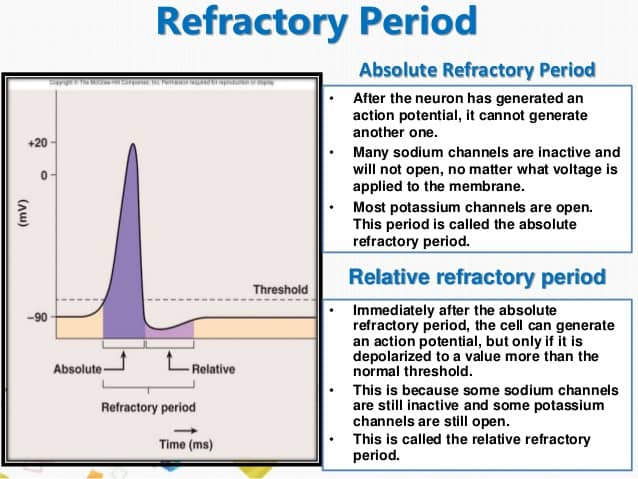

# Question 13

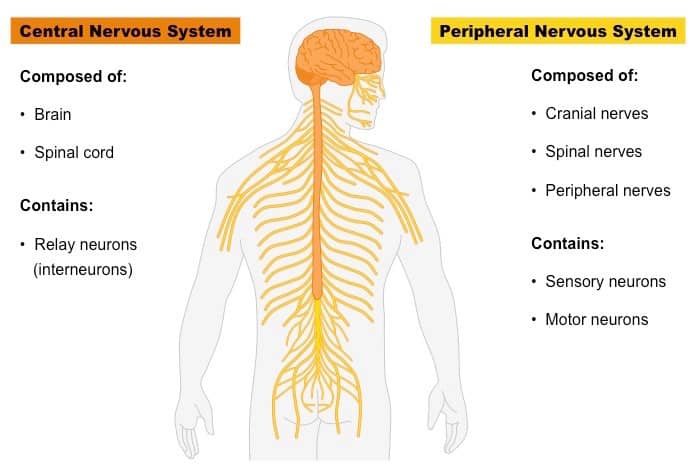

# Question 14

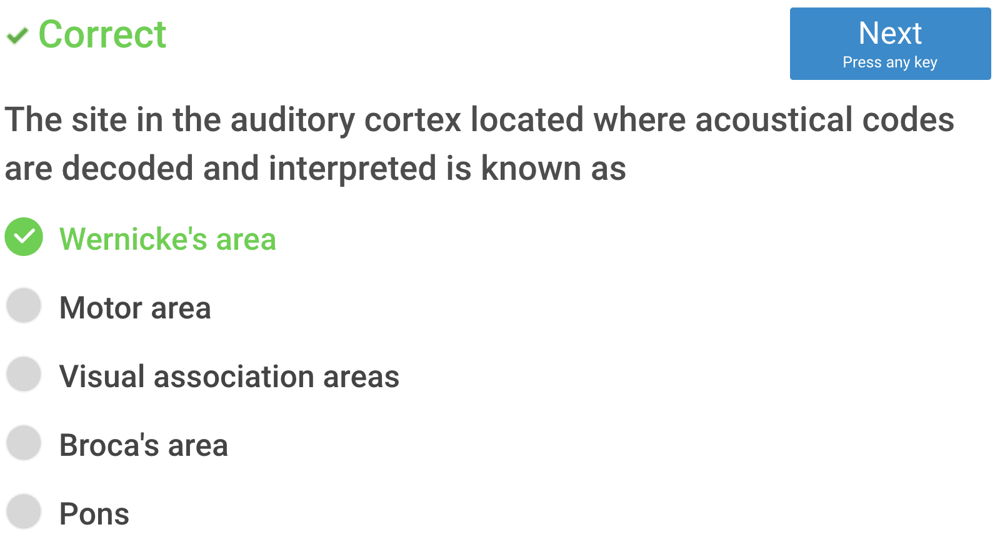

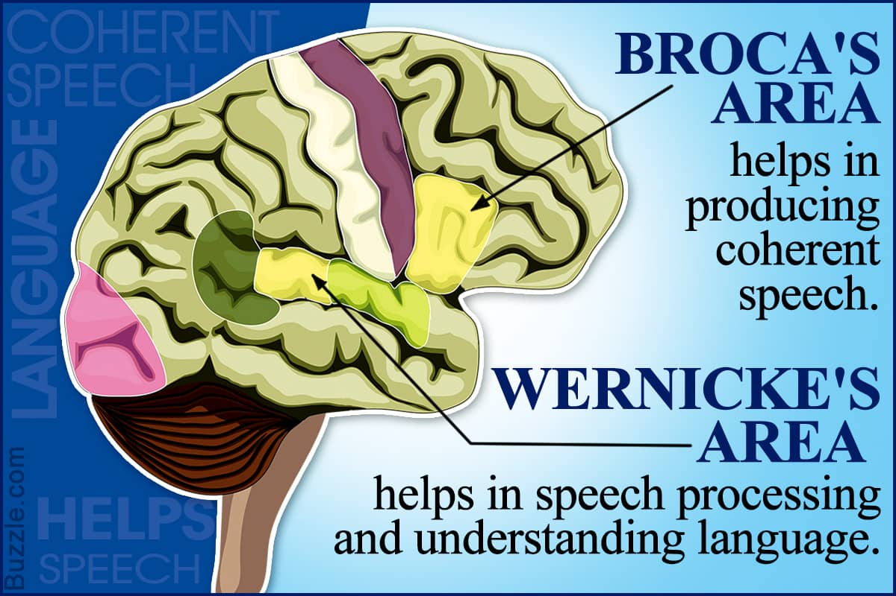

# Question 15

- Adrenaline: a hormone secreted by the adrenal glands, especially in conditions of stress, increasing rates of blood circulation, breathing, and carbohydrate metabolism and preparing muscles for exertion.
- Steroid: any of a large class of organic compounds with a characteristic molecular structure containing four rings of carbon atoms
- Acetylcholine: a compound that occurs throughout the nervous system, in which it functions as a neurotransmitter
- Endorphin: The principal function of endorphins is to inhibit the communication of pain signals; they may also produce a feeling of euphoria very similar to that produced by other opioids
- GABA: a neurotransmitter that blocks impulses between nerve cells in the brain

# Question 16

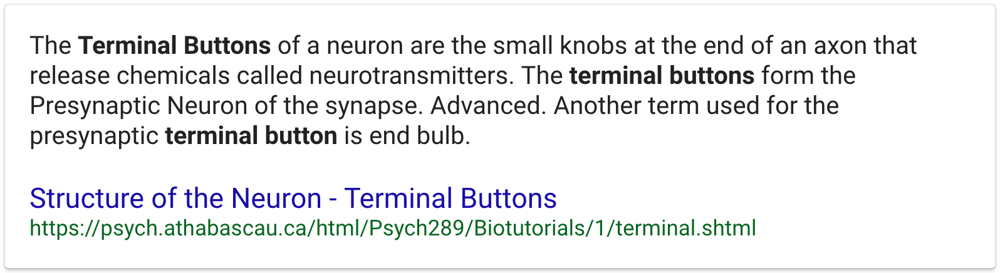

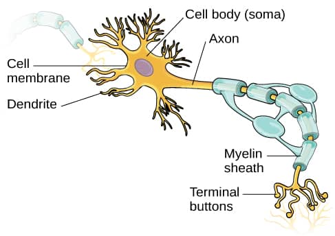

# Question 17

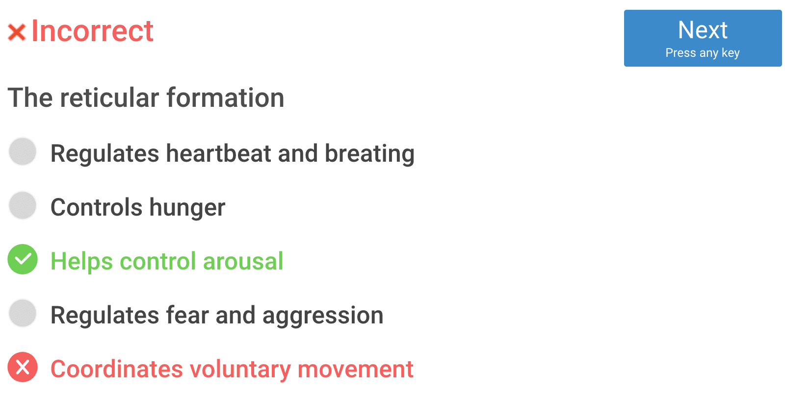

# Question 18

# Question 20

- Sensory adaptation

	- a change over time in the responsiveness of the sensory system to a constant stimulus.

		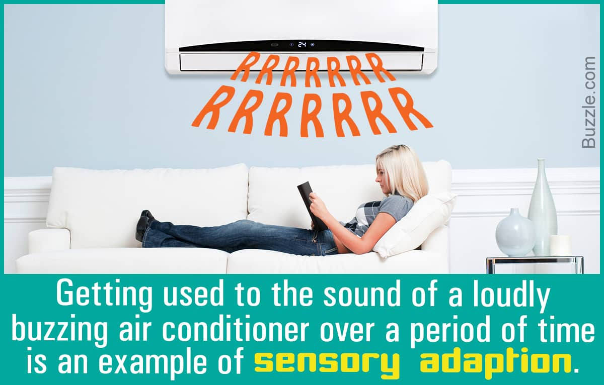

- Weber's Law

	- the change in a stimulus that will be just noticeable is a constant ratio of the original stimulus.

		

- The Young–Helmholtz theory

	- a theory of trichromatic color vision – the manner in which the photoreceptor cells in the eyes of humans and other primates work to enable color vision.

	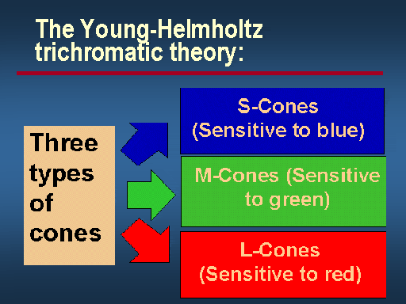

- Opponent-process theory

	- a psychological and neurological model that accounts for a wide range of behaviors, including color vision
	-  Opponent process theory suggests that color perception is controlled by the activity of two opponent systems: a blue-yellow mechanism and a red-green mechanism.

	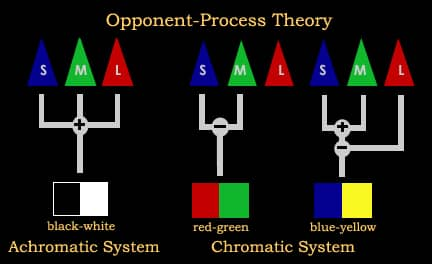

- Feature detection theory

	- The nervous system sorts or filters complex natural stimuli in order to extract behaviorally relevant cues that have a high probability of being associated with important objects or organisms in their environment, as opposed to irrelevant background or noise.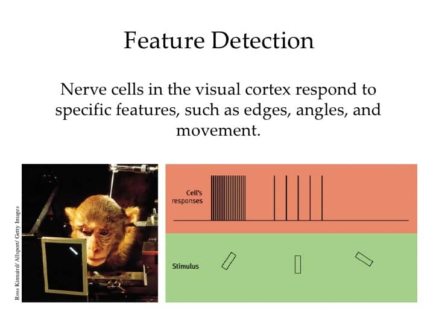