[Exam Link](https://www.proprofs.com/quiz-school/story.php?title=clep-introductory-psychology)

# Question 9

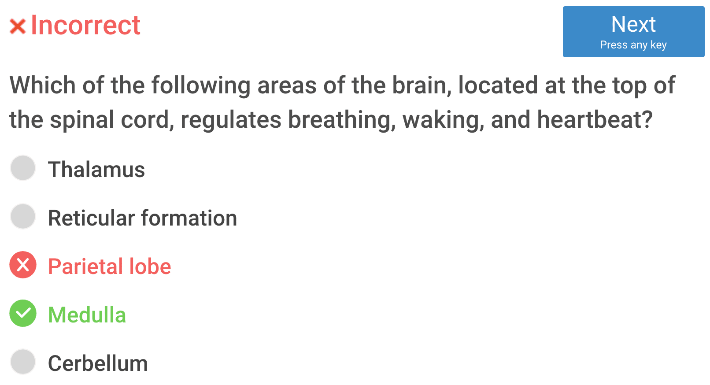

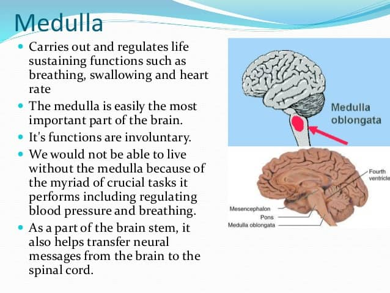

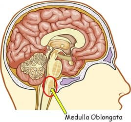

- Carries out and regulates life sustaining functions such as **breathing**, **swallowing** and **heart rate** 
- It's functions are **involuntary**, or done without thought.

# Question 11

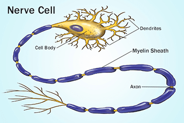

- The main purpose of myelin is to increase the speed at which electrical impulses propagate along the myelinated fiber
- In unmyelinated fibers, electrical impulses (action potentials) travel as continuous waves, but, in myelinated fibers, they "hop" or propagate by saltatory conduction.

# Question 12

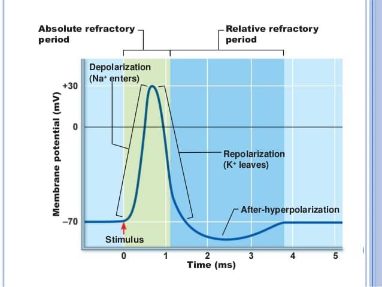

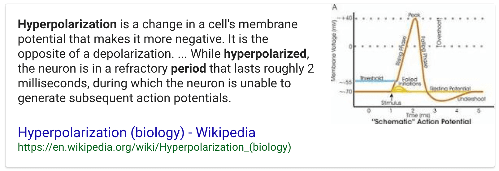

# Question 13

# Question 14

# Question 15

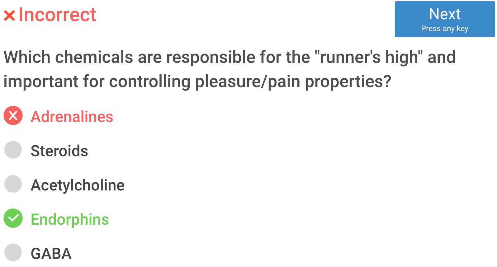

- Adrenaline: a hormone secreted by the adrenal glands, especially in conditions of stress, increasing rates of blood circulation, breathing, and carbohydrate metabolism and preparing muscles for exertion.
- Steroid: any of a large class of organic compounds with a characteristic molecular structure containing four rings of carbon atoms
- Acetylcholine: a compound that occurs throughout the nervous system, in which it functions as a neurotransmitter
- Endorphin: The principal function of endorphins is to inhibit the communication of pain signals; they may also produce a feeling of euphoria very similar to that produced by other opioids
- GABA: a neurotransmitter that blocks impulses between nerve cells in the brain

# Question 16

# Question 17

# Question 18

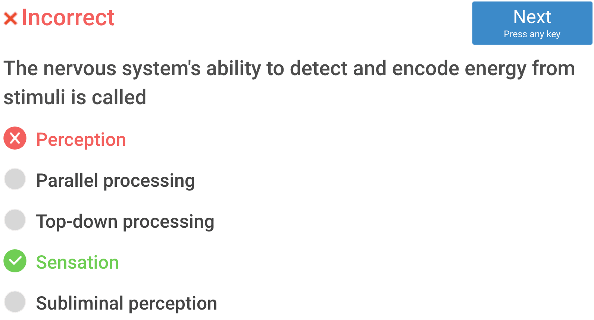

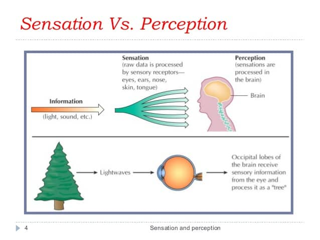

# Question 20

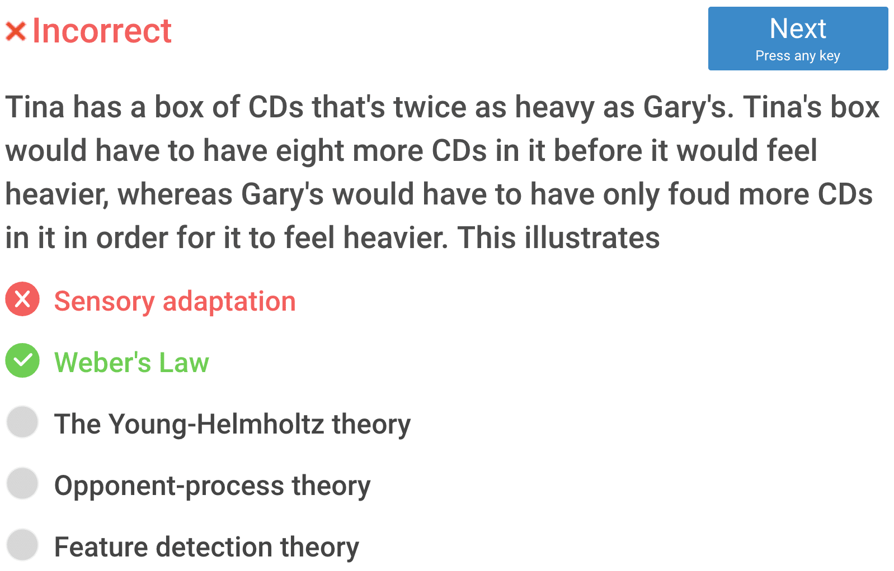

- Sensory adaptation

	- a change over time in the responsiveness of the sensory system to a constant stimulus.

		

- Weber's Law

	- the change in a stimulus that will be just noticeable is a constant ratio of the original stimulus.

		

- The Young–Helmholtz theory

	- a theory of trichromatic color vision – the manner in which the photoreceptor cells in the eyes of humans and other primates work to enable color vision.

	

- Opponent-process theory

	- a psychological and neurological model that accounts for a wide range of behaviors, including color vision
	-  Opponent process theory suggests that color perception is controlled by the activity of two opponent systems: a blue-yellow mechanism and a red-green mechanism.

	

- Feature detection theory

	- The nervous system sorts or filters complex natural stimuli in order to extract behaviorally relevant cues that have a high probability of being associated with important objects or organisms in their environment, as opposed to irrelevant background or noise.

# Question 21

 

# Question 22

- The Barnum effect

  - a common psychological phenomenon whereby individuals give high accuracy ratings to descriptions of their personality that supposedly are tailored specifically to them, that are in fact vague and general enough to apply to a wide range of people

  	

  	

- Locus of control

	- A person with an internal locus of control believes that he or she can influence events and their outcomes, while someone with an external locus of control blames outside forces for everything.

	

- The self-serving bias

	- A self-serving bias is any cognitive or perceptual process that is distorted by the need to maintain and enhance self-esteem, or the tendency to perceive oneself in an overly favorable manner.

	

- Reciprocal determinism

	- a person's behavior both influences and is influenced by personal factors and the social environment

	

# Question 23

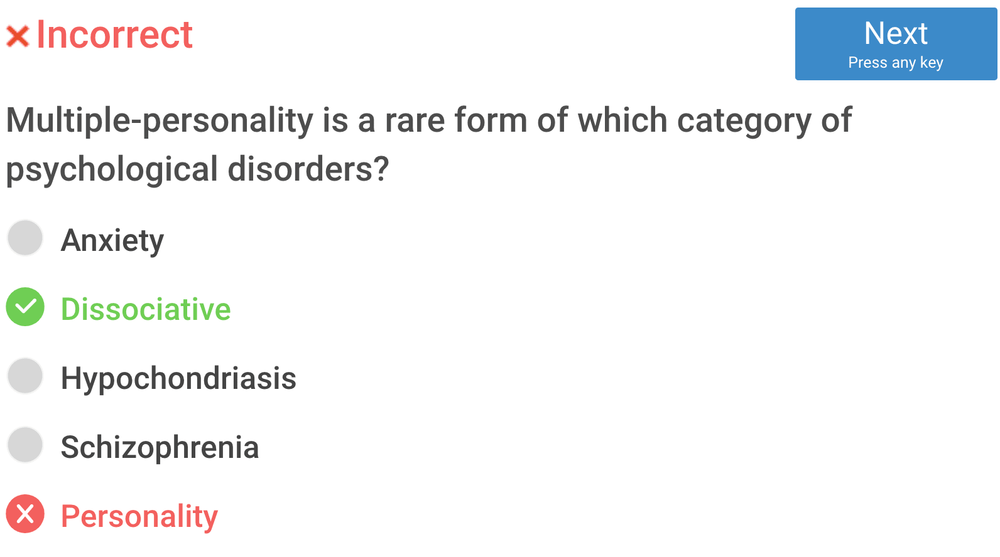

- Dissociative Identity Disorder = Multiple Personality Disorder

# Question 25

# Question 26

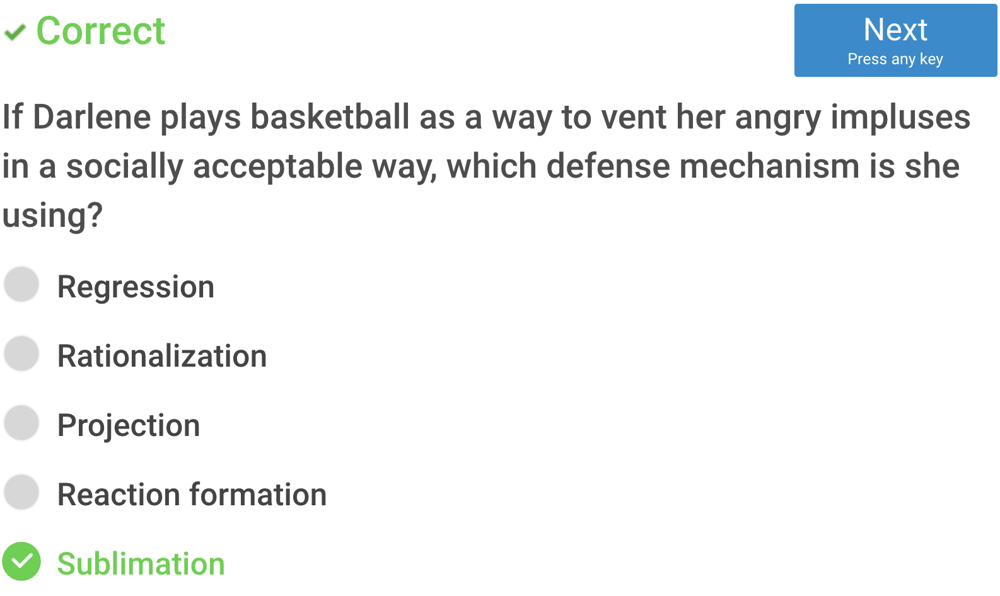

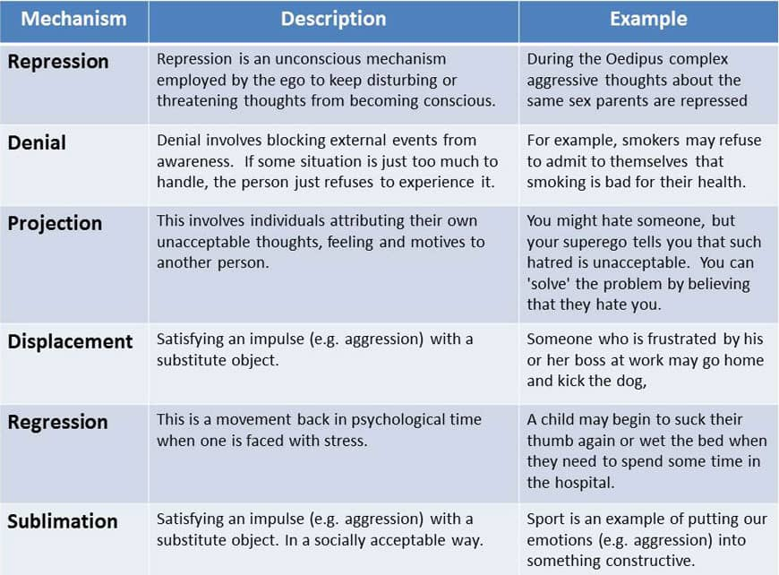

# Question 27

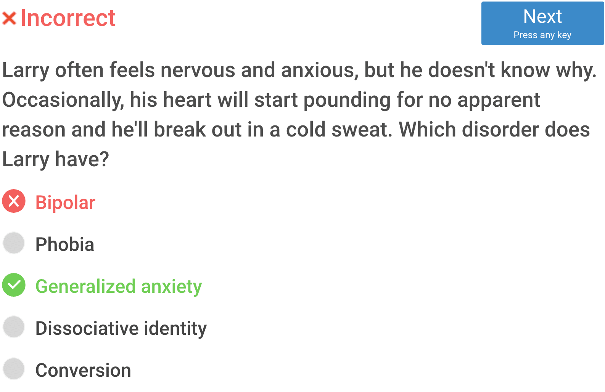

- Generalized anxiety disorder (or GAD) is characterized by excessive, exaggerated anxiety and worry about everyday life events with no obvious reasons for worry.

# Question 28

- Zygote: a diploid cell resulting from the fusion of two haploid gametes; a fertilized ovum.
- Embryo: the early developmental stage of an animal while it is in the egg or within the uterus of the mother
- Fetus: an unborn offspring of a mammal, in particular an unborn human baby more than eight weeks after conception

# Question 32

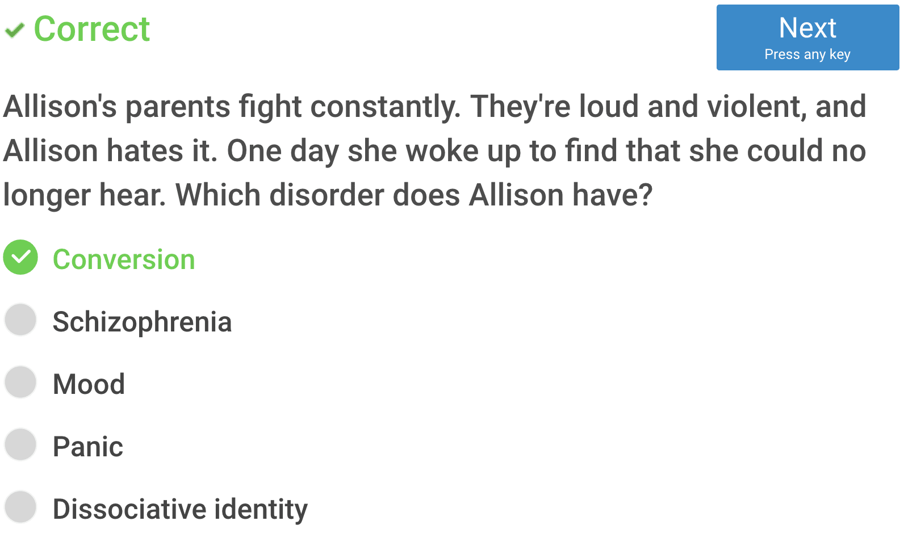

- Conversion disorder is a mental condition in which a person has blindness, paralysis, or other nervous system (neurologic) symptoms that cannot be explained by medical evaluation.

	

# Question 34

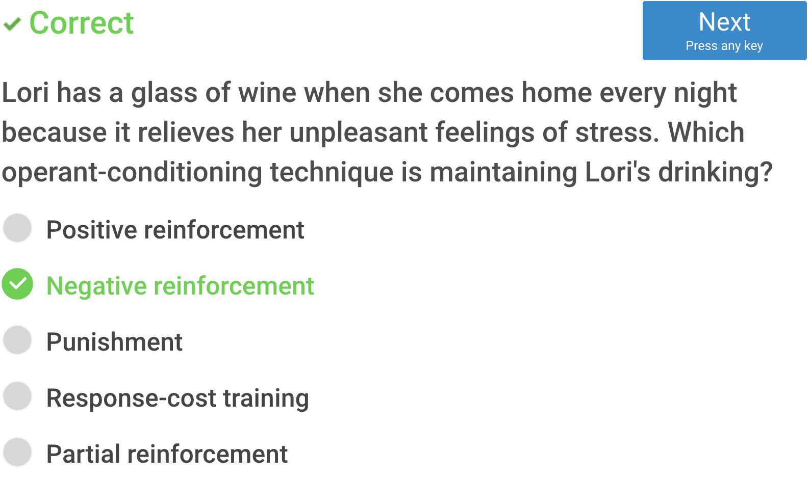

# Question 38

# Question 40

- **Thorazine** is used to manage and reduce hallucinations, **delusions**, extreme emotions, and other related symptoms that generally accompany schizophrenia

# Question 41

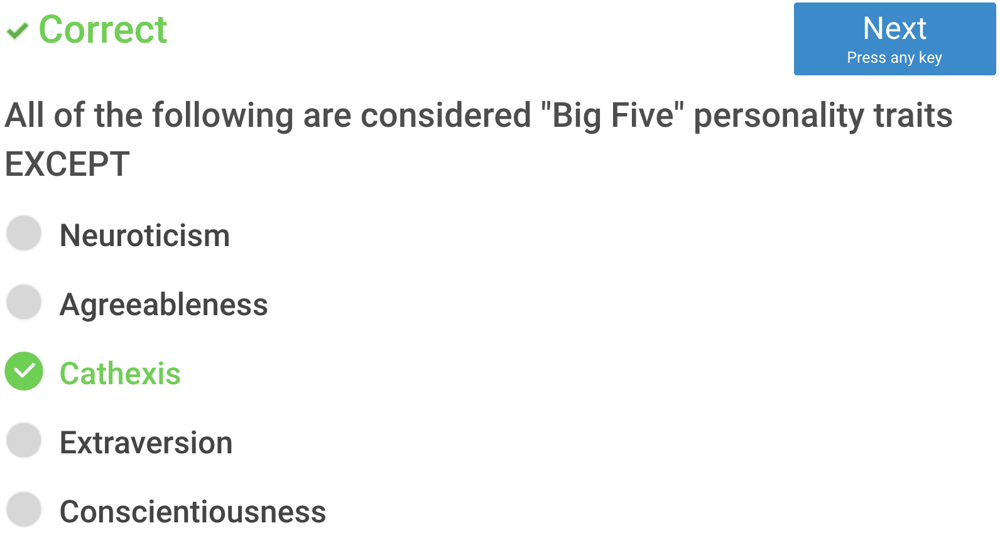

# Question 45

# Question 51

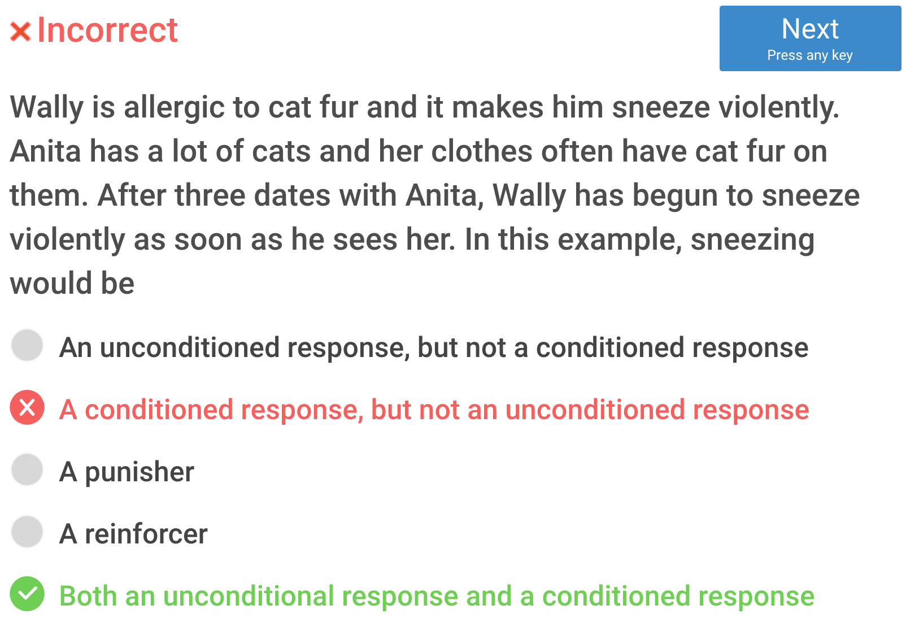

# Question 55

# Question 57

- Iconic memory is part of the **visual memory system** which also includes long-term memory and visual short-term memory. It is a type of sensory memory that lasts very briefly before quickly fading.
- Implicit memory is one of the two main types of **long-term human memory**. It is acquired and used **unconsciously**, and can affect thoughts and behaviours.
- Echoic memory is the sensory memory register specific to auditory information (**sounds**).
- A flashbulb memory is a highly **detailed**, exceptionally **vivid** '**snapshot**' of the **moment and circumstances** in which a piece of **surprising and consequential** (or emotionally arousing) news was heard.
- Working memory is a cognitive system with a limited capacity that is responsible for **temporarily holding information** available for **processing**

# Question 60

# Question 61

